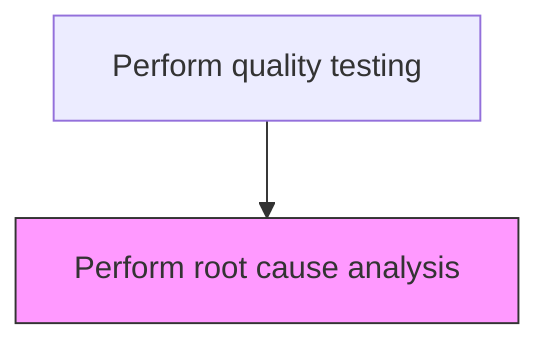
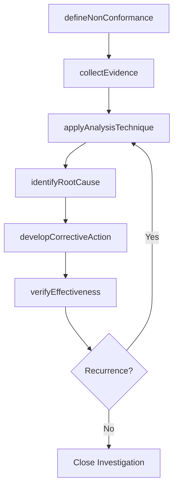

# Perform root cause analysis

> Business-as-Code definition for perform root cause analysis. Models the quality-testing activities within manufacturing to ensure efficient and compliant production operations.

## Overview

Using a technique that helps people answer the question of why a problem occurred in the first place. It seeks to identify the origin of a problem using a specific set of steps, with associated tools, to find the primary cause of the problem to determine what happened, why, and how to reduce the likelihood that it will happen again.

## Process Hierarchy



## GraphDL

```yaml
perform:
  object: Root Cause Analysis
  actor: QualityInspector
  result: PerformOutcome
```

## Actions

| Action | Description |
|--------|-------------|
| defineNonConformance | Clearly describe the defect, failure, or out-of-spec condition to investigate |
| collectEvidence | Gather samples, process data, operator logs, and inspection records related to the incident |
| applyAnalysisTechnique | Execute a structured methodology such as 5 Whys, Ishikawa, or fault tree analysis |
| identifyRootCause | Determine the fundamental systemic cause underlying the observed nonconformance |
| developCorrectiveAction | Design corrective and preventive actions to eliminate the identified root cause |
| verifyEffectiveness | Confirm that implemented corrections successfully prevent recurrence |

## Events

| Event | Description |
|-------|-------------|
| nonConformanceDefined | Defect or failure formally documented with scope and severity |
| evidenceCollected | Supporting data, samples, and logs gathered for analysis |
| analysisCompleted | Root cause analysis technique executed and conclusions reached |
| rootCauseIdentified | Fundamental cause determined and validated with evidence |
| correctiveActionDeveloped | CAPA plan created with responsible parties and timelines |
| effectivenessVerified | Post-implementation monitoring confirms recurrence prevention |

## Searches

| Search | Description |
|--------|-------------|
| findOpenInvestigations | List active root cause analyses by product, line, or severity |
| getRootCauseHistory | Query past root cause findings for a given product family or defect type |
| getCorrectiveActions | Retrieve CAPA plans and their implementation status |
| getNonConformanceTrends | Analyze recurring nonconformance patterns across production lines |

## Process Flow



## RACI Matrix

| Activity | Responsible | Accountable | Consulted | Informed |
|----------|-------------|-------------|-----------|----------|
| defineNonConformance | QualityEngineer | QualityManager | ProductionSupervisor | PlantManager |
| collectEvidence | QualityEngineer | QualityManager | ProcessEngineer | Maintenance |
| applyAnalysisTechnique | QualityEngineer | QualityManager | ProductionEngineer | Operations |
| identifyRootCause | QualityEngineer | QualityManager | ProcessEngineer | SupplyChain |
| developCorrectiveAction | QualityEngineer | QualityManager | ProductionSupervisor | Regulatory |
| verifyEffectiveness | QualityEngineer | PlantManager | QualityAssurance | Executive |

## Related Processes

| Process | Relationship |
|---------|-------------|
| 4.3.1 Schedule production | Upstream - production schedule drives execution |
| 4.3.3 Perform quality testing | Parent process |
| 4.1.5 Create and manage master production schedule | Upstream - MPS provides production targets |

## Related Departments

| Department | Role |
|-----------|------|
| Manufacturing | Primary owner of production operations |
| Quality Assurance | Validates product quality and process compliance |
| Maintenance | Ensures equipment reliability for production |
| Supply Chain | Coordinates materials availability for production |

## Related Occupations

| Occupation | Involvement |
|-----------|-------------|
| Quality Engineer | Leads root cause investigations and develops corrective actions |
| Process Engineer | Provides process data and validates analysis conclusions |
| Production Supervisor | Implements corrective actions on the production floor |

## KPIs

| KPI | Description | Unit |
|-----|-------------|------|
| Investigation Closure Time | Average days from nonconformance report to root cause identification | Days |
| Corrective Action Effectiveness | Percentage of CAPAs that prevent defect recurrence within 6 months | % |
| Repeat Nonconformance Rate | Percentage of root causes that recur after corrective action | % |
| Investigation Backlog | Number of open root cause investigations at any point | Count |

## Usage

```typescript
import { performRootCauseAnalysis } from '@headlessly/perform-root-cause-analysis'

const rca = performRootCauseAnalysis()

// Define the nonconformance to investigate
const investigation = await rca.defineNonConformance({
  ncNumber: 'NC-2025-0421',
  defectType: 'dimensional-out-of-spec',
  productLine: 'Precision Bearings',
  severity: 'major'
})

// Apply root cause analysis technique
const analysis = await rca.applyAnalysisTechnique({
  investigationId: investigation.id,
  methodology: 'ishikawa',
  categories: ['machine', 'method', 'material', 'measurement']
})

// Develop corrective action plan
const capa = await rca.developCorrectiveAction({
  investigationId: investigation.id,
  rootCauseId: analysis.rootCauseId,
  actions: ['recalibrate-cnc-spindle', 'update-setup-procedure'],
  targetDate: '2025-05-15'
})
```
