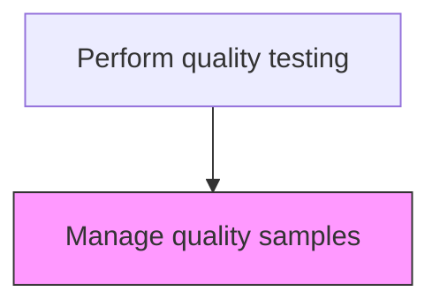
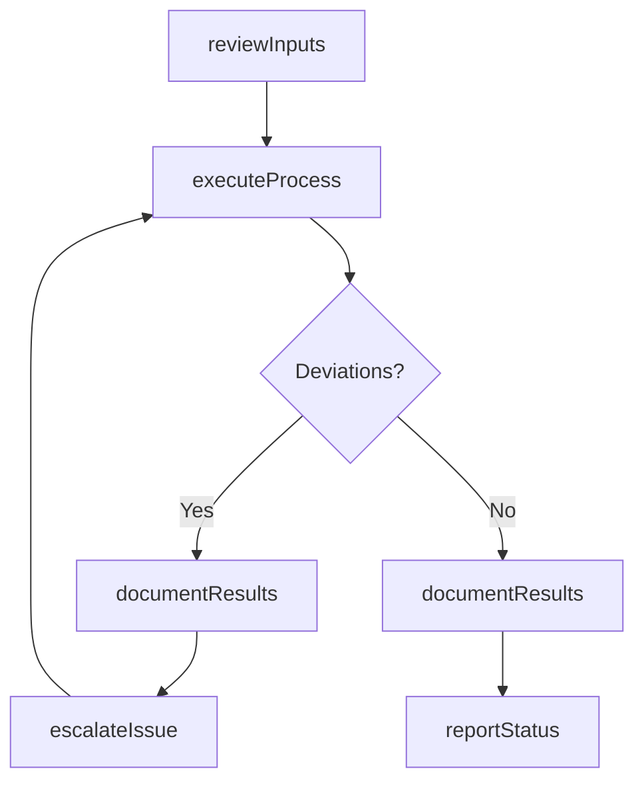

# Manage quality samples

> Business-as-Code definition for manage quality samples. Models the quality-testing activities within manufacturing to ensure efficient and compliant production operations.

## Overview

Selecting a set of elements from a product lot to draw conclusions or make inferences about the quality of the product lot from which the sample is drawn. Sampling is frequently used because gathering data on every product produced by a company is often impossible, impractical, or too costly to collect.

## Process Hierarchy



## GraphDL

```yaml
manage:
  object: Quality Samples
  actor: QualityInspector
  result: ManageOutcome
```

## Actions

| Action | Description |
|--------|-------------|
| manageActivity | Manage quality samples per established procedures |
| reviewInputs | Assess required inputs and prerequisites for manage quality samples |
| executeProcess | Carry out the core quality-testing tasks following standard operating procedures |
| documentResults | Record outcomes, observations, and any deviations from standard |
| reportStatus | Communicate status and results to supervisors and downstream teams |

## Events

| Event | Description |
|-------|-------------|
| inputsReviewed | Inputs and prerequisites assessed for manage quality samples |
| processExecuted | Core quality-testing tasks completed per standard procedures |
| resultsDocumented | Outcomes and observations recorded in production records |
| statusReported | Status and results communicated to relevant teams |
| deviationDetected | Non-standard condition identified during process execution |

## Searches

| Search | Description |
|--------|-------------|
| getProductionStatus | Retrieve current status of manage quality samples activities |
| getProductionRecords | Query production records for a specific batch, lot, or period |
| findDeviations | Identify deviations from standard operating procedures |
| getPerformanceMetrics | Query performance metrics for quality-testing activities |

## Process Flow



## RACI Matrix

| Activity | Responsible | Accountable | Consulted | Informed |
|----------|-------------|-------------|-----------|----------|
| reviewInputs | QualityInspector | PlantManager | QualityAssurance | SupplyChain |
| executeProcess | QualityInspector | PlantManager | Maintenance | Quality |
| documentResults | QualityInspector | PlantManager | QualityAssurance | Regulatory |

## Related Processes

| Process | Relationship |
|---------|-------------|
| 4.3.1 Schedule production | Upstream - production schedule drives execution |
| 4.3.3 Perform quality testing | Parent process |
| 4.1.5 Create and manage master production schedule | Upstream - MPS provides production targets |

## Related Departments

| Department | Role |
|-----------|------|
| Manufacturing | Primary owner of production operations |
| Quality Assurance | Validates product quality and process compliance |
| Maintenance | Ensures equipment reliability for production |
| Supply Chain | Coordinates materials availability for production |

## Related Occupations

| Occupation | Involvement |
|-----------|-------------|
| QualityInspector | Leads quality-testing activities on the shop floor |
| Quality Inspector | Verifies product and process quality |
| Production Supervisor | Oversees daily production execution |

## KPIs

| KPI | Description | Unit |
|-----|-------------|------|
| Overall Equipment Effectiveness | Combined measure of availability, performance, and quality | % |
| First Pass Yield | Percentage of products passing quality on first attempt | % |
| Production Cycle Time | Average time to complete manage quality samples | Hours |

## Usage

```typescript
import { manageQualitySamples } from '@headlessly/manage-quality-samples'

const client = manageQualitySamples()

// Review inputs for production activity
const inputs = await client.reviewInputs({
  productionOrderId: 'PO-2025-0847',
  checkMaterials: true,
  checkEquipment: true
})

// Execute the production process
const result = await client.executeProcess({
  inputsId: inputs.id,
  standardProcedure: 'SOP-QUAL-001'
})
```
