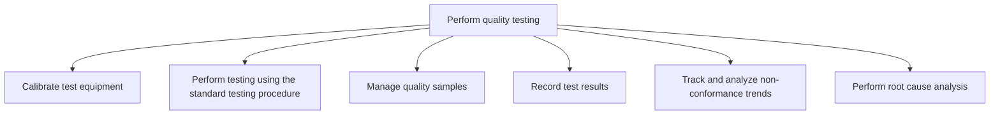
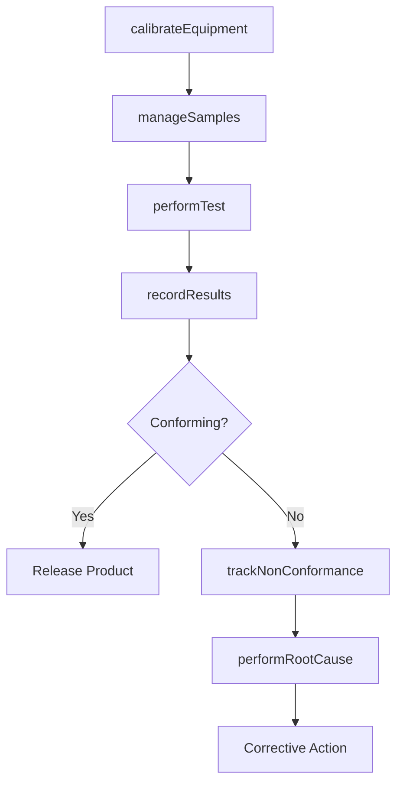

# Perform quality testing

> Business-as-Code definition for quality testing execution. Models equipment calibration, standard testing, sample management, result recording, non-conformance tracking, and root cause analysis as programmable workflows.

## Overview

Executing tests to evaluate the quality of the products manufactured. Calibrate the test equipment. Conduct the actual tests. Record the results and outcomes of the quality test conducted.

## Process Hierarchy



## GraphDL

```yaml
perform:
  object: Quality Testing
  actor: QualityInspector
  result: QualityTestReport
```

## Actions

| Action | Description |
|--------|-------------|
| calibrateEquipment | Verify and adjust test equipment accuracy |
| performTest | Execute standard testing procedure on product samples |
| manageSamples | Select, label, and track quality test samples |
| recordResults | Document test outcomes and pass/fail determinations |
| trackNonConformance | Monitor and analyze non-conformance trends over time |
| performRootCause | Investigate underlying causes of quality failures |

## Events

| Event | Description |
|-------|-------------|
| equipmentCalibrated | Test equipment calibration verified and certified |
| testPerformed | Quality test executed per standard procedure |
| samplesManaged | Quality samples collected, tested, and dispositioned |
| resultsRecorded | Test results documented in quality management system |
| nonConformanceTracked | Non-conformance trend analysis updated |
| rootCauseIdentified | Root cause of quality failure determined |

## Searches

| Search | Description |
|--------|-------------|
| getTestResults | Retrieve test results by lot, product, or date range |
| findNonConformances | Query non-conformance records by type or severity |
| getCalibrationStatus | Check calibration status and next-due dates for equipment |
| getRootCauseHistory | Retrieve root cause analysis records by defect type |

## Process Flow



## RACI Matrix

| Activity | Responsible | Accountable | Consulted | Informed |
|----------|-------------|-------------|-----------|----------|
| calibrateEquipment | MetrologyTechnician | QAManager | Engineering | Production |
| performTest | QualityInspector | QAManager | Production | SupplyChain |
| recordResults | QualityInspector | QAManager | IT | Production, Regulatory |
| performRootCause | QualityEngineer | QAManager | Production, Engineering | Executive |

## Sub-Processes

| ID | Name | Description |
|----|------|-------------|
| 4.3.3.1 | Calibrate test equipment | Regulating the equipment used for performing quality tests. Assess correspondence between the qualit |
| 4.3.3.2 | Perform testing using the standard testing procedure | Performing testing using calibrated equipment and in consent with the standard testing procedure, in |
| 4.3.3.3 | Manage quality samples | Selecting a set of elements from a product lot to draw conclusions or make inferences about the qual |
| 4.3.3.4 | Record test results | Documenting the results and outcomes of the quality tests. Track the performance of the production p |
| 4.3.3.5 | Track and analyze non-conformance trends | Managing and monitoring the occurrences of problems with a process or product. It is important that  |
| 4.3.3.6 | Perform root cause analysis | Using a technique that helps people answer the question of why a problem occurred in the first place |

## Related Processes

| Process | Relationship |
|---------|-------------|
| 4.1.9 Develop quality standards and procedures | Upstream - standards define test criteria |
| 4.3.2 Produce/Assemble product | Upstream - finished goods arrive for testing |
| 4.3.4 Maintain production records | Downstream - test results link to lot records |

## Related Departments

| Department | Role |
|-----------|------|
| Quality Assurance | Primary owner of testing operations |
| Manufacturing | Provides products for testing and implements corrective actions |
| Metrology | Manages calibration and measurement equipment |

## Related Occupations

| Occupation | Involvement |
|-----------|-------------|
| Quality Inspector | Test execution and result recording |
| Quality Engineer | Root cause analysis and corrective actions |
| Metrology Technician | Equipment calibration and maintenance |

## KPIs

| KPI | Description | Unit |
|-----|-------------|------|
| First Pass Yield | Percentage of products passing quality on first test | % |
| Non-Conformance Rate | Number of non-conformances per 1000 units tested | Per 1000 |
| Calibration Compliance | Percentage of equipment calibrated within schedule | % |
| Root Cause Resolution Time | Average time from defect detection to root cause closure | Days |

## Usage

```typescript
import { performQualityTesting } from '@headlessly/perform-quality-testing'

const client = performQualityTesting()

// Perform standard quality test
const test = await client.performTest({
  lotNumber: 'LOT-2025-05-001',
  procedure: 'STP-dimensional-check',
  sampleSize: 32,
  acceptanceCriteria: 'AQL-1.0'
})

// Perform root cause analysis on failure
const rootCause = await client.performRootCause({
  nonConformanceId: 'NC-2025-0456',
  method: 'fishbone',
  team: ['quality-engineer', 'process-engineer', 'operator']
})
```
