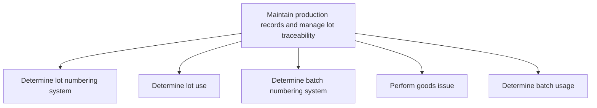
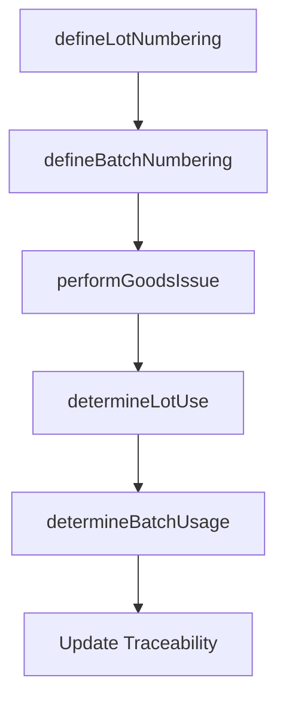

# Maintain production records and manage lot traceability

> Business-as-Code definition for production records and lot traceability. Models lot and batch numbering, usage tracking, goods issue processing, and material genealogy as programmable workflows.

## Overview

Maintaining production records and managing traceability of production lots and batches through the manufacturing process. Define lot and batch numbering systems, track material usage and consumption, perform goods issue transactions, and enable end-to-end traceability from raw materials through finished goods.

## Process Hierarchy



## GraphDL

```yaml
maintain:
  object: Production Records And Manage Lot Traceability
  actor: ProductionRecordKeeper
  result: TraceabilityRecord
```

## Actions

| Action | Description |
|--------|-------------|
| defineLotNumbering | Establish lot identification and numbering conventions |
| determineLotUse | Define where and how production lots are consumed |
| defineBatchNumbering | Set up batch identification and numbering system |
| performGoodsIssue | Process material issuance from stock to production |
| determineBatchUsage | Track batch consumption and disposition across processes |

## Events

| Event | Description |
|-------|-------------|
| lotNumberingDefined | Lot numbering system established and configured |
| lotUseRecorded | Production lot usage and disposition documented |
| batchNumberingDefined | Batch numbering system configured |
| goodsIssued | Materials issued from inventory to production orders |
| batchUsageRecorded | Batch consumption tracked and genealogy updated |

## Searches

| Search | Description |
|--------|-------------|
| traceLotGenealogy | Trace lot from raw materials through finished goods |
| findBatchHistory | Query batch usage records and disposition |
| getGoodsIssueLog | Retrieve material issuance transactions by order or date |
| getTraceabilityReport | Generate end-to-end traceability report for a product |

## Process Flow



## RACI Matrix

| Activity | Responsible | Accountable | Consulted | Informed |
|----------|-------------|-------------|-----------|----------|
| defineLotNumbering | ProductionRecordKeeper | QAManager | IT, Production | Compliance |
| performGoodsIssue | WarehouseClerk | ProductionSupervisor | Materials, Finance | QA |
| determineBatchUsage | ProductionClerk | QAManager | Production | Regulatory |

## Sub-Processes

| ID | Name | Description |
|----|------|-------------|
| 4.3.4.1 | Determine lot numbering system | Allotting an identification number to a particular quantity or lot of material manufactured. Assign  |
| 4.3.4.2 | Determine lot use | Identifying the use of production lots. Define where, how, and when to use a specific production lot |
| 4.3.4.3 | Determine batch numbering system | Determine batch numbering system within the supply chain to ensure operational efficiency and alignment with organizational objectives |
| 4.3.4.4 | Perform goods issue | Perform goods issue within the supply chain to ensure operational efficiency and alignment with organizational objectives |
| 4.3.4.5 | Determine batch usage | Determine batch usage within the supply chain to ensure operational efficiency and alignment with organizational objectives |

## Related Processes

| Process | Relationship |
|---------|-------------|
| 4.3.2 Produce/Assemble product | Upstream - production operations generate lot records |
| 4.3.3 Perform quality testing | Parallel - test results link to lot traceability |
| 4.4.3 Operate warehousing | Downstream - lot data travels with inventory |

## Related Departments

| Department | Role |
|-----------|------|
| Production | Primary source of lot and batch records |
| Quality Assurance | Links quality data to lot traceability |
| Compliance | Ensures traceability meets regulatory requirements |

## Related Occupations

| Occupation | Involvement |
|-----------|-------------|
| Production Record Keeper | Lot and batch documentation management |
| Quality Data Analyst | Traceability report generation |
| Compliance Officer | Regulatory traceability audit |

## KPIs

| KPI | Description | Unit |
|-----|-------------|------|
| Traceability Coverage | Percentage of finished goods with complete genealogy | % |
| Record Accuracy | Percentage of lot records matching physical inventory | % |
| Trace-Back Time | Time to complete full traceability trace for a product | Hours |

## Usage

```typescript
import { maintainProductionRecordsAndManageLotTraceability } from '@headlessly/maintain-production-records-and-manage-lot-traceability'

const client = maintainProductionRecordsAndManageLotTraceability()

// Perform goods issue to production
const issue = await client.performGoodsIssue({
  productionOrderId: 'PO-MFG-2025-0890',
  materials: [{ id: 'MAT-001', quantity: 500, lotNumber: 'LOT-RM-2025-042' }],
  issuedBy: 'warehouse-clerk-01'
})

// Trace lot genealogy
const trace = await client.traceLotGenealogy({
  finishedGoodLot: 'LOT-FG-2025-0123',
  depth: 'full',
  includeQualityData: true
})
```
