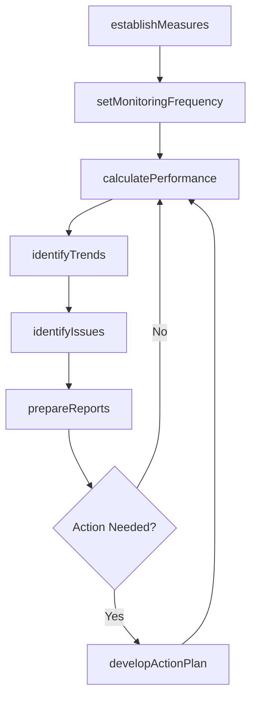

# Assess production performance (master production schedule -MPS and manufacturing resource planning - MRP)

> Business-as-Code definition for production performance assessment. Models MPS/MRP performance measurement, trend identification, issue detection, reporting, and action planning as programmable workflows.

## Overview

Evaluating production performance against master production schedule (MPS) and manufacturing resource planning (MRP) targets. Establish performance measures and monitoring frequency, calculate actual metrics, identify trends and issues, generate reports, and develop improvement action plans.

## Process Hierarchy

```mermaid
graph TD
    A[Assess production performance (master production schedule -MPS and manufacturing resource planning - MRP)]
    A --> B[Establish appropriate performance measures]
    A --> C[Establish production monitoring frequency]
    A --> D[Calculate production performance measures]
    A --> E[Identify production performance trends]
    A --> F[Identify issues/problems with performance]
    A --> G[Prepare appropriate reports]
    A --> H[Develop action plan to improve performance]
```

## GraphDL

```yaml
assess:
  object: Production Performance (master Production Schedule -MPS And Manufacturing Resource Planning - MRP)
  actor: ProductionAnalyst
  result: PerformanceReport
```

## Actions

| Action | Description |
|--------|-------------|
| establishMeasures | Define appropriate production performance KPIs |
| setMonitoringFrequency | Determine how often performance is measured |
| calculatePerformance | Compute production metrics against MPS and MRP targets |
| identifyTrends | Analyze performance data to detect patterns |
| identifyIssues | Flag performance problems requiring attention |
| prepareReports | Generate production performance reports for stakeholders |
| developActionPlan | Create improvement plans to address performance gaps |

## Events

| Event | Description |
|-------|-------------|
| measuresEstablished | Performance KPIs defined and approved |
| monitoringFrequencySet | Measurement cadence determined |
| performanceCalculated | Production metrics computed for the period |
| trendsIdentified | Performance trends detected in data analysis |
| issuesIdentified | Performance problems flagged for resolution |
| reportsPrepared | Performance reports distributed to stakeholders |
| actionPlanDeveloped | Improvement plan created and assigned |

## Searches

| Search | Description |
|--------|-------------|
| getPerformanceDashboard | Retrieve real-time production performance summary |
| findPerformanceGaps | Identify lines or products below target performance |
| getTrendAnalysis | Query performance trends over specified time periods |
| getActionPlanStatus | Track progress of active improvement initiatives |

## Process Flow



## RACI Matrix

| Activity | Responsible | Accountable | Consulted | Informed |
|----------|-------------|-------------|-----------|----------|
| establishMeasures | ProductionAnalyst | PlantManager | Engineering, QA | Finance |
| calculatePerformance | ProductionAnalyst | PlantManager | Production, SupplyChain | Executive |
| identifyIssues | ProductionAnalyst | PlantManager | Engineering, Maintenance | Operations |
| developActionPlan | ContinuousImprovementLead | PlantManager | Production, QA | Executive |

## Sub-Processes

| ID | Name | Description |
|----|------|-------------|
| 4.3.5.1 | Establish appropriate performance measures | Establish appropriate performance measures within the supply chain to ensure operational efficiency and alignment with organizational objectives |
| 4.3.5.2 | Establish production monitoring frequency | Establish production monitoring frequency within the supply chain to ensure operational efficiency and alignment with organizational objectives |
| 4.3.5.3 | Calculate production performance measures | Calculate production performance measures within the supply chain to ensure operational efficiency and alignment with organizational objectives |
| 4.3.5.4 | Identify production performance trends | Identify production performance trends within the supply chain to ensure operational efficiency and alignment with organizational objectives |
| 4.3.5.5 | Identify issues/problems with performance | Identify issues/problems with performance within the supply chain to ensure operational efficiency and alignment with organizational objectives |
| 4.3.5.6 | Prepare appropriate reports | Prepare appropriate reports within the supply chain to ensure operational efficiency and alignment with organizational objectives |
| 4.3.5.7 | Develop action plan to improve performance | Develop action plan to improve performance within the supply chain to ensure operational efficiency and alignment with organizational objectives |

## Related Processes

| Process | Relationship |
|---------|-------------|
| 4.3.1 Schedule production | Upstream - schedule provides planned targets |
| 4.3.2 Produce/Assemble product | Upstream - actual production data feeds assessment |
| 4.1.5 Create and manage master production schedule | Parallel - MPS adherence is a key metric |

## Related Departments

| Department | Role |
|-----------|------|
| Production | Primary source of performance data |
| Continuous Improvement | Leads improvement action plans |
| Engineering | Provides technical root cause expertise |

## Related Occupations

| Occupation | Involvement |
|-----------|-------------|
| Production Analyst | Performance calculation and trend analysis |
| Continuous Improvement Engineer | Action plan development and execution |
| Plant Manager | Performance governance and decision-making |

## KPIs

| KPI | Description | Unit |
|-----|-------------|------|
| MPS Attainment | Percentage of master production schedule completed | % |
| MRP Accuracy | Variance between planned and actual material requirements | % |
| OEE Trend | Overall equipment effectiveness improvement over time | % Change |
| Corrective Action Closure Rate | Percentage of improvement actions completed on time | % |

## Usage

```typescript
import { assessProductionPerformance } from '@headlessly/assess-production-performance-mps-and-mrp'

const client = assessProductionPerformance()

// Calculate production performance metrics
const metrics = await client.calculatePerformance({
  plantId: 'plant-midwest',
  period: '2025-05',
  targets: { mpsAttainment: 95, oee: 85, yield: 98 }
})

// Develop action plan for identified gaps
const plan = await client.developActionPlan({
  issueId: 'PERF-2025-0034',
  rootCause: 'changeover-delays',
  actions: ['SMED-training', 'standardize-tooling'],
  targetDate: '2025-07-01'
})
```
