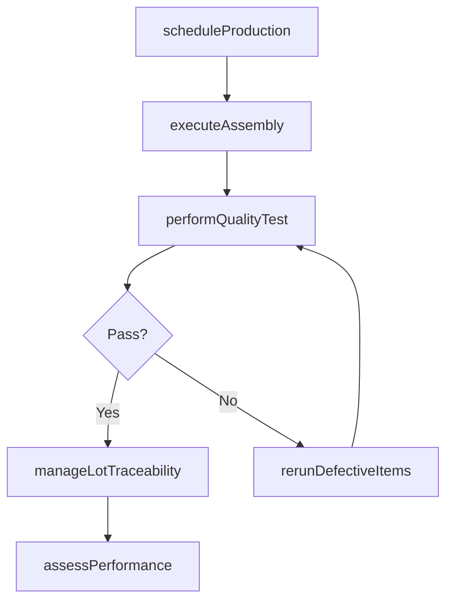

# Produce/Assemble/Test product

> Business-as-Code definition for manufacturing operations. Models production scheduling, assembly execution, quality testing, lot traceability, and performance assessment as programmable workflows.

## Overview

Processing and delivering the finished goods manufactured by the organization. Schedule the production of products. Execute the product production activities. Perform tests to oversee and ensure quality of production. Maintain records of the production process. Track lots.

## Process Hierarchy

```mermaid
graph TD
    A[Produce/Assemble/Test product]
    A --> B[Schedule production]
    A --> C[Produce/Assemble product]
    A --> D[Perform quality testing]
    A --> E[Maintain production records and manage lot traceability]
    A --> F[Assess production performance (master production schedule -MPS and manufacturing resource planning - MRP)]
```

## GraphDL

```yaml
produce/assemble/test:
  object: Product
  actor: ProductionManager
  result: FinishedGood
```

## Actions

| Action | Description |
|--------|-------------|
| scheduleProduction | Generate line-level plans, detailed schedules, and production orders |
| executeAssembly | Run production lines converting raw materials to finished goods |
| performQualityTest | Execute standard testing procedures and record results |
| manageLotTraceability | Assign lot and batch numbers and track material genealogy |
| assessPerformance | Measure production output against MPS and MRP targets |
| rerunDefectiveItems | Rework or reprocess items that failed quality inspection |
| scheduleMaintenance | Plan preventive and unplanned equipment maintenance |

## Events

| Event | Description |
|-------|-------------|
| productionScheduled | Production orders created and released to shop floor |
| assemblyCompleted | Product assembly run finished on production line |
| qualityTestPassed | Product passed all standard quality tests |
| qualityTestFailed | Product failed quality testing and flagged for rework |
| lotRecorded | Lot or batch number assigned and traceability recorded |
| performanceAssessed | Production performance metrics calculated and reported |
| maintenanceScheduled | Equipment maintenance order created and scheduled |

## Searches

| Search | Description |
|--------|-------------|
| getProductionOrders | Retrieve production orders by status, line, or date range |
| findLotHistory | Trace lot genealogy from raw materials through finished goods |
| getQualityResults | Query quality test results by product, lot, or date |
| getProductionMetrics | Retrieve OEE, yield, and throughput performance data |
| findMaintenanceSchedule | List planned and unplanned maintenance activities |

## Process Flow



## RACI Matrix

| Activity | Responsible | Accountable | Consulted | Informed |
|----------|-------------|-------------|-----------|----------|
| scheduleProduction | ProductionPlanner | PlantManager | SupplyChain | Operations |
| executeAssembly | ProductionSupervisor | PlantManager | Engineering, QA | SupplyChain |
| performQualityTest | QualityInspector | QAManager | Production | Regulatory |
| manageLotTraceability | ProductionClerk | QAManager | Warehouse | Compliance |
| assessPerformance | ProductionAnalyst | PlantManager | Finance, Engineering | Executive |

## Sub-Processes

| ID | Name | Description |
|----|------|-------------|
| 4.3.1 | Schedule production | Scheduling the production of final products. Generate a detailed schedule plan. Create and release p |
| 4.3.2 | Produce/Assemble product | Manufacturing the product. Convert the raw materials to develop consumer-ready products. Manage the  |
| 4.3.3 | Perform quality testing | Executing tests to evaluate the quality of the products manufactured. Calibrate the test equipment.  |
| 4.3.4 | Maintain production records and manage lot traceability | Maintain production records and manage lot traceability within the supply chain to ensure operational efficiency and alignment with organizational objectives |
| 4.3.5 | Assess production performance (master production schedule -MPS and manufacturing resource planning - MRP) | Assess production performance (master production schedule -MPS and manufacturing resource planning - MRP) within the supply chain to ensure operational efficiency and alignment with organizational objectives |

## Related Processes

| Process | Relationship |
|---------|-------------|
| 4.1 Plan for and align supply chain resources | Upstream - production schedule drives manufacturing |
| 4.2 Procure materials and services | Upstream - procured materials feed production lines |
| 4.4 Manage logistics and warehousing | Downstream - finished goods move to warehouse |
| 4.3.3 Perform quality testing | Child - quality gate before finished goods release |

## Related Departments

| Department | Role |
|-----------|------|
| Manufacturing | Primary owner of production and assembly operations |
| Quality Assurance | Manages testing procedures and quality standards |
| Maintenance | Ensures equipment reliability and uptime |
| Supply Chain | Coordinates materials availability for production |
| Engineering | Provides technical specifications and process design |

## Related Occupations

| Occupation | Involvement |
|-----------|-------------|
| Production Manager | Manufacturing operations oversight |
| Quality Inspector | Product testing and conformance verification |
| Production Planner | Shop floor scheduling and order management |
| Maintenance Technician | Equipment upkeep and repair |

## KPIs

| KPI | Description | Unit |
|-----|-------------|------|
| Overall Equipment Effectiveness | Combined availability, performance, and quality rate | % |
| First Pass Yield | Percentage of units passing quality on first attempt | % |
| Production Throughput | Units produced per shift or time period | Units/Shift |
| Defect Rate | Number of defective units per million produced | PPM |
| Schedule Attainment | Percentage of planned production orders completed on time | % |

## Usage

```typescript
import { produceAssembleTestProduct } from '@headlessly/produce-assemble-test-product'

const client = produceAssembleTestProduct()

// Schedule a production run
const order = await client.scheduleProduction({
  productId: 'SKU-5500',
  quantity: 1000,
  lineId: 'line-A3',
  startDate: '2025-05-01'
})

// Execute quality testing
const results = await client.performQualityTest({
  productionOrderId: order.id,
  testProcedure: 'STP-electrical-safety',
  sampleSize: 50
})

// Track lot traceability
const lot = await client.manageLotTraceability({
  lotNumber: order.lotNumber,
  rawMaterials: ['MAT-001', 'MAT-002'],
  productionDate: '2025-05-02'
})
```
