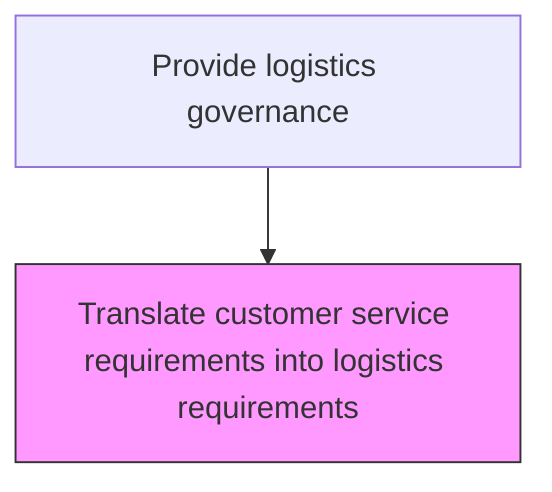
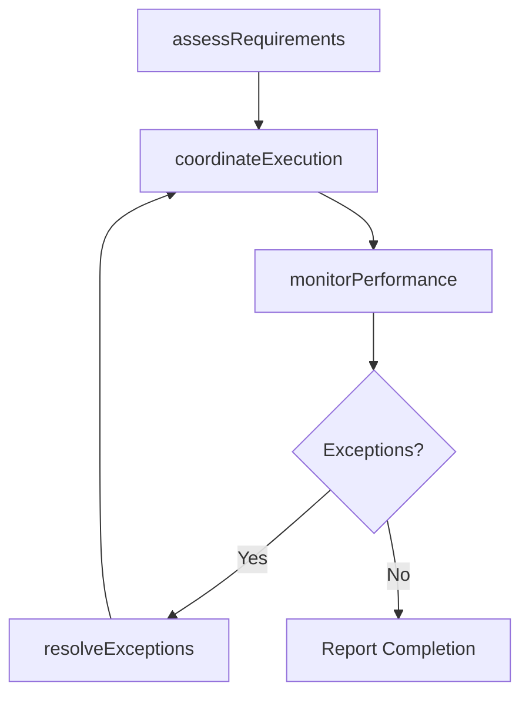

# Translate customer service requirements into logistics requirements

> Business-as-Code definition for translate customer service requirements into logistics requirements. Models the logistics governance processes to ensure efficient movement, storage, and compliance of goods throughout the supply chain.

## Overview

Determining the requirements for managing the flow of things between the point of origin and the point of consumption by assessing the service requirements of the customers.

## Process Hierarchy



## GraphDL

```yaml
translate:
  object: Customer Service Requirements Into Logistics Requirements
  actor: LogisticsDirector
  result: TranslateOutput
```

## Actions

| Action | Description |
|--------|-------------|
| translateActivity | Translate customer service requirements into logistics requirements following established logistics procedures |
| assessRequirements | Evaluate operational requirements for translate customer service requirements into logistics requirements |
| coordinateExecution | Coordinate logistics activities with internal teams and external partners |
| monitorPerformance | Track performance metrics for logistics governance activities |
| resolveExceptions | Identify and address operational exceptions and delays |

## Events

| Event | Description |
|-------|-------------|
| requirementsAssessed | Operational requirements evaluated for translate customer service requirements into logistics requirements |
| executionCoordinated | Logistics activities coordinated with all parties |
| performanceMonitored | logistics governance performance metrics updated |
| exceptionsResolved | Operational exceptions identified and addressed |
| activityCompleted | Translate customer service requirements into logistics requirements completed and documented |

## Searches

| Search | Description |
|--------|-------------|
| getOperationalStatus | Retrieve current status of translate customer service requirements into logistics requirements activities |
| findExceptions | Identify pending exceptions requiring attention |
| getPerformanceDashboard | Query performance metrics for logistics governance operations |
| getShipmentTracking | Retrieve real-time tracking data for shipments and materials |

## Process Flow



## RACI Matrix

| Activity | Responsible | Accountable | Consulted | Informed |
|----------|-------------|-------------|-----------|----------|
| assessRequirements | LogisticsDirector | VP Logistics | SupplyChain | Finance |
| coordinateExecution | LogisticsDirector | VP Logistics | Warehousing, Carriers | CustomerService |
| monitorPerformance | LogisticsAnalyst | VP Logistics | Operations | Executive |

## Related Processes

| Process | Relationship |
|---------|-------------|
| 4.4.1 Provide logistics governance | Parent process |
| 4.1.6 Plan distribution requirements | Upstream - distribution plans drive logistics execution |
| 4.4.3 Operate warehousing | Parallel - warehousing supports logistics flow |

## Related Departments

| Department | Role |
|-----------|------|
| Logistics | Primary owner of logistics operations |
| Warehousing | Manages storage, picking, and staging operations |
| Transportation | Handles carrier management and shipment execution |
| Customer Service | Communicates delivery status to customers |

## Related Occupations

| Occupation | Involvement |
|-----------|-------------|
| LogisticsDirector | Leads logistics governance operations |
| Logistics Coordinator | Coordinates daily logistics activities |
| Warehouse Associate | Executes physical warehouse operations |

## KPIs

| KPI | Description | Unit |
|-----|-------------|------|
| On-Time Performance | Percentage of logistics governance activities completed on schedule | % |
| Cost Per Unit | Average logistics cost per unit for logistics governance | USD/Unit |
| Exception Rate | Frequency of exceptions in logistics governance operations | Count/Week |

## Usage

```typescript
import { translateCustomerServiceRequirementsIntoLogisticsRequirements } from '@headlessly/translate-customer-service-requirements-into-logistics-requirements'

const client = translateCustomerServiceRequirementsIntoLogisticsRequirements()

// Assess requirements for logistics activity
const requirements = await client.assessRequirements({
  activityType: 'logistics-governance',
  scope: 'customer-service-requirements-',
  period: '2025-08'
})

// Coordinate execution with partners
const execution = await client.coordinateExecution({
  requirementsId: requirements.id,
  partners: ['carrier-a', 'warehouse-east']
})
```
