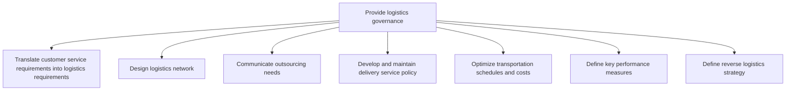
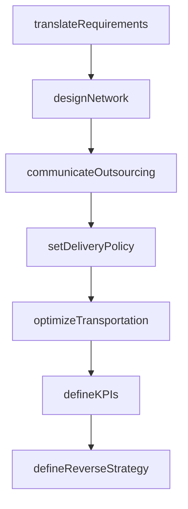

# Provide logistics governance

> Business-as-Code definition for logistics governance. Models customer-to-logistics translation, network design, transportation optimization, delivery policy management, and reverse logistics strategy as programmable workflows.

## Overview

Outlining the strategy for managing logistics. Translate customer requirements logistic requirements. Create an efficient logistic network and outsourcing portions of logistics activities. Design a logistics strategy that optimizes transportation costs and schedule. Define key performance indicators.

## Process Hierarchy



## GraphDL

```yaml
provide:
  object: Logistics Governance
  actor: LogisticsDirector
  result: LogisticsGovernanceFramework
```

## Actions

| Action | Description |
|--------|-------------|
| translateRequirements | Convert customer service requirements into logistics specs |
| designNetwork | Create optimal logistics network for distribution |
| communicateOutsourcing | Define and share third-party logistics needs |
| setDeliveryPolicy | Establish and maintain delivery service terms |
| optimizeTransportation | Minimize transportation costs while meeting service targets |
| defineKPIs | Establish logistics performance measurement framework |
| defineReverseStrategy | Set strategy for returns, repairs, and reverse logistics |

## Events

| Event | Description |
|-------|-------------|
| requirementsTranslated | Customer SLAs converted to logistics specifications |
| networkDesigned | Logistics network model completed and approved |
| outsourcingCommunicated | 3PL requirements shared with potential providers |
| deliveryPolicySet | Delivery service policy published |
| transportationOptimized | Transportation routes and costs optimized |
| kpisDefined | Logistics KPI framework established |
| reverseStrategyDefined | Reverse logistics strategy published |

## Searches

| Search | Description |
|--------|-------------|
| getNetworkDesign | Retrieve current logistics network configuration |
| getDeliveryPolicy | Query delivery service policies and SLAs |
| getTransportCostAnalysis | Retrieve transportation cost optimization results |
| getLogisticsKPIs | Query logistics performance indicators and targets |

## Process Flow



## RACI Matrix

| Activity | Responsible | Accountable | Consulted | Informed |
|----------|-------------|-------------|-----------|----------|
| translateRequirements | LogisticsPlanner | LogisticsDirector | Sales, CustomerService | Operations |
| designNetwork | NetworkDesigner | VP SupplyChain | Finance, IT | Executive |
| optimizeTransportation | TransportationPlanner | LogisticsDirector | Carriers, Finance | Sales |
| defineReverseStrategy | ReverseLogisticsManager | LogisticsDirector | CustomerService, QA | Finance |

## Sub-Processes

| ID | Name | Description |
|----|------|-------------|
| 4.4.1.1 | Translate customer service requirements into logistics requirements | Determining the requirements for managing the flow of things between the point of origin and the poi |
| 4.4.1.2 | Design logistics network | Developing a network for logistical activities. Create a network of entities through which materials |
| 4.4.1.3 | Communicate outsourcing needs | Conveying outsourcing needs within the organization, with the objective of sourcing the assistance r |
| 4.4.1.4 | Develop and maintain delivery service policy | Establishing rules and regulations, as well as the terms and conditions regarding the delivery of se |
| 4.4.1.5 | Optimize transportation schedules and costs | Optimizing the schedule and costs of transportation services. Design a logistics strategy by strateg |
| 4.4.1.6 | Define key performance measures | Establishing measures for evaluating the performance of the logistics strategy of the organization.  |
| 4.4.1.7 | Define reverse logistics strategy | Establish a strategy that includes rules and regulations for the physical handling, information proc |

## Related Processes

| Process | Relationship |
|---------|-------------|
| 4.4.2 Plan and manage inbound material flow | Downstream - governance policies guide inbound operations |
| 4.4.3 Operate warehousing | Downstream - delivery policies shape warehouse operations |
| 4.4.4 Operate outbound transportation | Downstream - transportation optimization guides shipping |

## Related Departments

| Department | Role |
|-----------|------|
| Logistics | Primary owner of governance framework |
| Customer Service | Defines customer delivery requirements |
| Transportation | Executes optimized transport operations |
| Finance | Validates logistics cost targets |

## Related Occupations

| Occupation | Involvement |
|-----------|-------------|
| Logistics Director | Governance framework ownership |
| Network Design Analyst | Logistics network optimization |
| Transportation Planner | Cost and schedule optimization |

## KPIs

| KPI | Description | Unit |
|-----|-------------|------|
| Logistics Cost-to-Serve | Total logistics cost as percentage of revenue | % |
| Network Coverage | Percentage of customer addresses within delivery SLA | % |
| Policy Compliance | Operations adherence to delivery service policies | % |

## Usage

```typescript
import { provideLogisticsGovernance } from '@headlessly/provide-logistics-governance'

const client = provideLogisticsGovernance()

// Design logistics network
const network = await client.designNetwork({
  region: 'North America',
  warehouses: ['DC-East', 'DC-Central', 'DC-West'],
  serviceLevel: 'next-day',
  optimizeFor: 'cost-and-coverage'
})

// Optimize transportation
const optimization = await client.optimizeTransportation({
  networkId: network.id,
  modes: ['truckload', 'LTL', 'parcel'],
  constraints: { maxTransitDays: 3, maxCostPerUnit: 2.50 }
})
```
