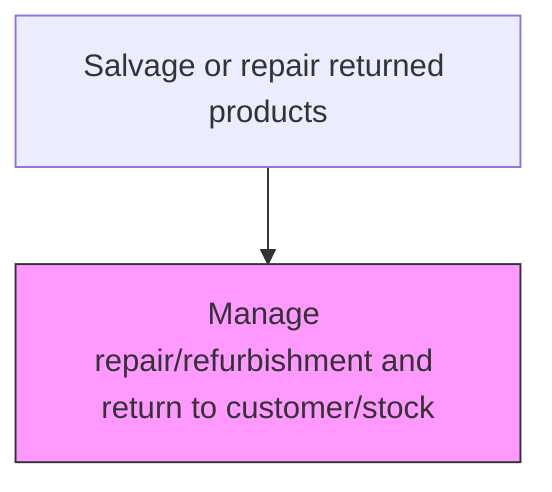
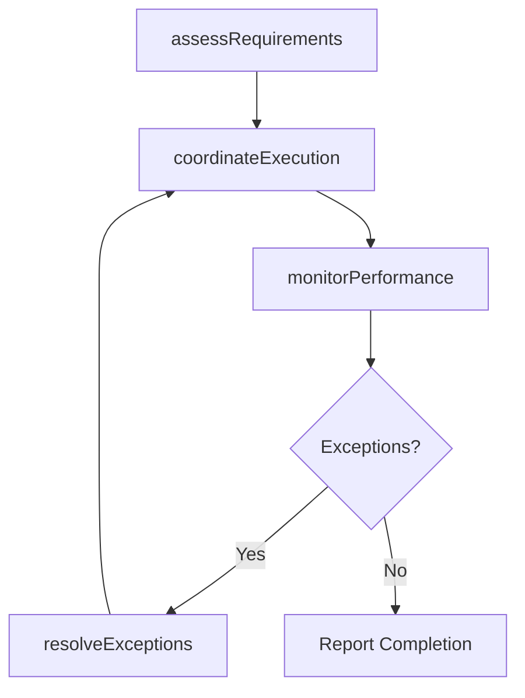

# Manage repair/refurbishment and return to customer/stock

> Business-as-Code definition for manage repair/refurbishment and return to customer/stock. Models the returns repair processes to ensure efficient movement, storage, and compliance of goods throughout the supply chain.

## Overview

Administering the reinstatement of the returned product in order to return them back to customers. Repair or remanufacture the defective or ineffective products returned by the customer. Process the delivery of the repaired or remanufactured products back to the customer.

## Process Hierarchy



## GraphDL

```yaml
manage:
  object: Repair/refurbishment And Return To Customer/stock
  actor: ReturnsManager
  result: ManageOutput
```

## Actions

| Action | Description |
|--------|-------------|
| manageActivity | Manage repair/refurbishment and return to customer/stock following established logistics procedures |
| assessRequirements | Evaluate operational requirements for manage repair/refurbishment and return to customer/stock |
| coordinateExecution | Coordinate logistics activities with internal teams and external partners |
| monitorPerformance | Track performance metrics for returns repair activities |
| resolveExceptions | Identify and address operational exceptions and delays |

## Events

| Event | Description |
|-------|-------------|
| requirementsAssessed | Operational requirements evaluated for manage repair/refurbishment and return to customer/stock |
| executionCoordinated | Logistics activities coordinated with all parties |
| performanceMonitored | returns repair performance metrics updated |
| exceptionsResolved | Operational exceptions identified and addressed |
| activityCompleted | Manage repair/refurbishment and return to customer/stock completed and documented |

## Searches

| Search | Description |
|--------|-------------|
| getOperationalStatus | Retrieve current status of manage repair/refurbishment and return to customer/stock activities |
| findExceptions | Identify pending exceptions requiring attention |
| getPerformanceDashboard | Query performance metrics for returns repair operations |
| getShipmentTracking | Retrieve real-time tracking data for shipments and materials |

## Process Flow



## RACI Matrix

| Activity | Responsible | Accountable | Consulted | Informed |
|----------|-------------|-------------|-----------|----------|
| assessRequirements | ReturnsManager | VP Logistics | SupplyChain | Finance |
| coordinateExecution | ReturnsManager | VP Logistics | Warehousing, Carriers | CustomerService |
| monitorPerformance | LogisticsAnalyst | VP Logistics | Operations | Executive |

## Related Processes

| Process | Relationship |
|---------|-------------|
| 4.4.1 Provide logistics governance | Upstream - governance policies guide logistics operations |
| 4.1.6 Plan distribution requirements | Upstream - distribution plans drive logistics execution |
| 4.4.3 Operate warehousing | Parallel - warehousing supports logistics flow |

## Related Departments

| Department | Role |
|-----------|------|
| Logistics | Primary owner of logistics operations |
| Warehousing | Manages storage, picking, and staging operations |
| Transportation | Handles carrier management and shipment execution |
| Customer Service | Communicates delivery status to customers |

## Related Occupations

| Occupation | Involvement |
|-----------|-------------|
| ReturnsManager | Leads returns repair operations |
| Logistics Coordinator | Coordinates daily logistics activities |
| Warehouse Associate | Executes physical warehouse operations |

## KPIs

| KPI | Description | Unit |
|-----|-------------|------|
| On-Time Performance | Percentage of returns repair activities completed on schedule | % |
| Cost Per Unit | Average logistics cost per unit for returns repair | USD/Unit |
| Exception Rate | Frequency of exceptions in returns repair operations | Count/Week |

## Usage

```typescript
import { manageRepair/refurbishmentAndReturnToCustomer/stock } from '@headlessly/manage-repairrefurbishment-and-return-to-customerstock'

const client = manageRepair/refurbishmentAndReturnToCustomer/stock()

// Assess requirements for logistics activity
const requirements = await client.assessRequirements({
  activityType: 'returns-repair',
  scope: 'repair/refurbishment-and-retur',
  period: '2025-08'
})

// Coordinate execution with partners
const execution = await client.coordinateExecution({
  requirementsId: requirements.id,
  partners: ['carrier-a', 'warehouse-east']
})
```
