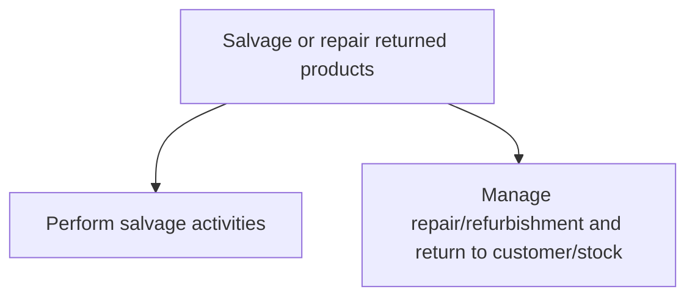
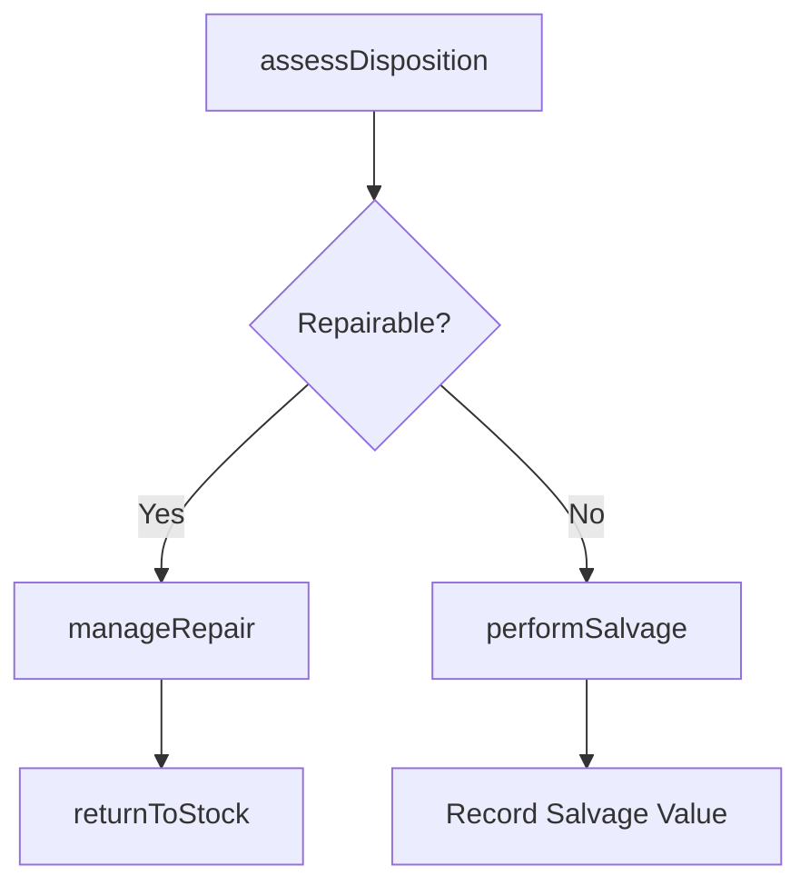

# Salvage or repair returned products

> Business-as-Code definition for returned product salvage and repair operations. Models salvage assessment, repair execution, refurbishment tracking, and return-to-stock processing as programmable workflows.

## Overview

Determining if a returned product can be salvaged or repaired. Salvage or repair is dependent upon the product, the condition of the product, or the availability of a like item.

## Process Hierarchy



## GraphDL

```yaml
salvage:
  object: Or Repair Returned Products
  actor: RepairCenterManager
  result: RefurbishedProduct
```

## Actions

| Action | Description |
|--------|-------------|
| performSalvage | Execute salvage activities on returned products deemed non-repairable |
| manageRepair | Coordinate repair and refurbishment of returned products |
| assessDisposition | Evaluate returned product condition to determine salvage, repair, or scrap |
| returnToStock | Process refurbished products back into available inventory |

## Events

| Event | Description |
|-------|-------------|
| salvagePerformed | Salvage activities completed and value recovered |
| repairManaged | Product repaired and refurbished to sellable condition |
| dispositionAssessed | Returned product evaluated and disposition assigned |
| returnedToStock | Refurbished product returned to available inventory |

## Searches

| Search | Description |
|--------|-------------|
| getDispositionQueue | Retrieve returned products awaiting disposition assessment |
| getRepairStatus | Query repair and refurbishment progress by order or product |
| getSalvageValue | Calculate recovered value from salvage activities |
| getRefurbishmentHistory | Retrieve refurbishment history for a product or SKU |

## Process Flow



## RACI Matrix

| Activity | Responsible | Accountable | Consulted | Informed |
|----------|-------------|-------------|-----------|----------|
| assessDisposition | QualityInspector | RepairCenterManager | ProductEngineering | Finance |
| manageRepair | RepairTechnician | RepairCenterManager | QA, Parts | CustomerService |
| performSalvage | SalvageOperator | RepairCenterManager | Finance, Environmental | Warehouse |

## Sub-Processes

| ID | Name | Description |
|----|------|-------------|
| 4.4.2.6.1 | Perform salvage activities | Executing activities for reinstating the returned products. Present the customer with additional inc |
| 4.4.2.6.2 | Manage repair/refurbishment and return to customer/stock | Administering the reinstatement of the returned product in order to return them back to customers. R |

## Related Processes

| Process | Relationship |
|---------|-------------|
| 4.4.2.5 Control quality of returned parts | Upstream - quality assessment determines repair eligibility |
| 4.4.2.4 Manage flow of returned products | Upstream - returned products routed to salvage or repair |
| 4.4.3.7 Manage physical finished goods inventory | Downstream - refurbished items return to inventory |
| 6.3 Manage returns | Parallel - customer return process triggers salvage workflow |

## Related Departments

| Department | Role |
|-----------|------|
| Repair Center | Primary owner of salvage and refurbishment operations |
| Quality Assurance | Inspects returns and validates refurbishment quality |
| Warehousing | Manages restocking of refurbished products |
| Finance | Tracks salvage value recovery and repair costs |

## Related Occupations

| Occupation | Involvement |
|-----------|-------------|
| Repair Center Manager | Overall salvage and repair operations management |
| Repair Technician | Hands-on product repair and refurbishment |
| Quality Inspector | Product condition assessment and post-repair validation |

## KPIs

| KPI | Description | Unit |
|-----|-------------|------|
| Repair Success Rate | Percentage of returned products successfully repaired | % |
| Salvage Value Recovery | Revenue recovered from salvaged products | Currency |
| Repair Turnaround Time | Average time from receipt to completion of repair | Days |
| Return-to-Stock Rate | Percentage of returns refurbished and restocked | % |

## Usage

```typescript
import { salvageOrRepairReturnedProducts } from '@headlessly/salvage-or-repair-returned-products'

const client = salvageOrRepairReturnedProducts()

// Assess disposition of returned product
const disposition = await client.assessDisposition({
  returnOrderId: 'RMA-2025-0345',
  productId: 'SKU-8800',
  condition: 'cosmetic-damage',
  inspectionNotes: 'Minor scratching on enclosure, electronics functional'
})

// Manage repair
const repair = await client.manageRepair({
  returnOrderId: 'RMA-2025-0345',
  repairType: 'refurbishment',
  partsRequired: ['enclosure-panel'],
  targetCompletionDate: '2025-06-10'
})
```
