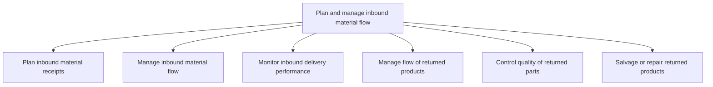
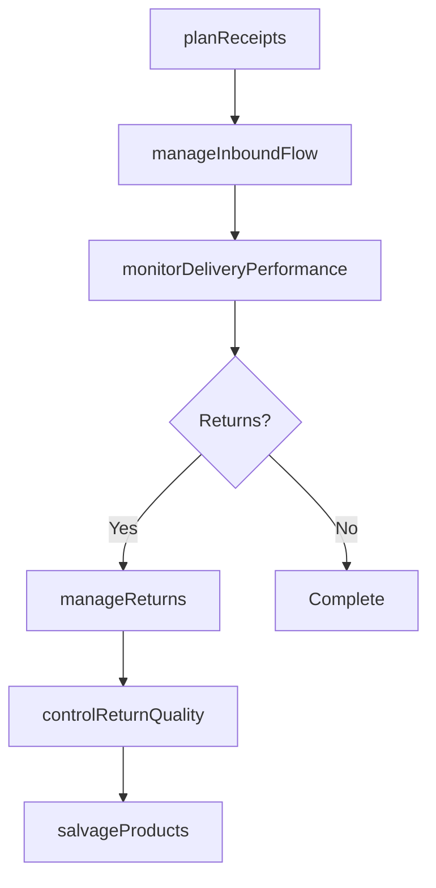

# Plan and manage inbound material flow

> Business-as-Code definition for inbound material flow management. Models receipt planning, material flow execution, delivery monitoring, returns processing, quality control, and salvage operations as programmable workflows.

## Overview

Creating and executing a strategy for all the internal activities related to the flow/transfer of inbound materials. This process includes planning inbound material receipts, managing inbound material flow, monitoring inbound delivery performance, managing the flow of returned products, controlling the quality of returned parts, and salvaging or repairing returned products.

## Process Hierarchy



## GraphDL

```yaml
plan:
  object: And Manage Inbound Material Flow
  actor: InboundLogisticsManager
  result: ReceivedMaterial
```

## Actions

| Action | Description |
|--------|-------------|
| planReceipts | Schedule and prepare for inbound material deliveries |
| manageInboundFlow | Coordinate dock scheduling and unloading operations |
| monitorDeliveryPerformance | Track supplier on-time delivery and completeness |
| manageReturns | Process returned products through reverse logistics |
| controlReturnQuality | Inspect returned parts for quality and disposition |
| salvageProducts | Determine if returned products can be repaired or salvaged |

## Events

| Event | Description |
|-------|-------------|
| receiptsPlanned | Inbound delivery schedule confirmed with suppliers |
| inboundFlowManaged | Materials received, unloaded, and directed to storage |
| deliveryPerformanceMonitored | Supplier delivery metrics updated |
| returnsManaged | Returned product processed and dispositioned |
| returnQualityControlled | Returned parts inspected and graded |
| productsSalvaged | Returned products repaired or sent to salvage |

## Searches

| Search | Description |
|--------|-------------|
| getInboundSchedule | Retrieve planned inbound deliveries by date or supplier |
| getDeliveryPerformance | Query supplier delivery metrics and trends |
| findReturnOrders | List return orders by status, reason, or customer |
| getSalvageDisposition | Retrieve salvage or repair disposition for returned goods |

## Process Flow



## RACI Matrix

| Activity | Responsible | Accountable | Consulted | Informed |
|----------|-------------|-------------|-----------|----------|
| planReceipts | ReceivingCoordinator | InboundLogisticsManager | Procurement | Production |
| manageInboundFlow | DockSupervisor | WarehouseManager | Transportation | Production |
| monitorDeliveryPerformance | LogisticsAnalyst | InboundLogisticsManager | Procurement | Finance |
| manageReturns | ReverseLogisticsCoordinator | InboundLogisticsManager | CustomerService | QA |

## Sub-Processes

| ID | Name | Description |
|----|------|-------------|
| 4.4.2.1 | Plan inbound material receipts | Managing the receipts of inbound materials. Create a plan accounting for the materials procured from |
| 4.4.2.2 | Manage inbound material flow | Managing all the internal activities related to the flow/transfer of materials. Manage materials bei |
| 4.4.2.3 | Monitor inbound delivery performance | Overseeing the performance of an inbound delivery system. Check the present delivery system's effici |
| 4.4.2.4 | Manage flow of returned products | Tracking and taking care of the products that have been internally returned either because of their  |
| 4.4.2.5 | Control quality of returned parts | Implement a checks and balances system to verify that returned parts meet acceptable quality standar |
| 4.4.2.6 | Salvage or repair returned products | Determining if a returned product can be salvaged or repaired. Salvage or repair is dependent upon t |

## Related Processes

| Process | Relationship |
|---------|-------------|
| 4.2.4 Order materials and services | Upstream - purchase orders trigger inbound receipts |
| 4.4.3 Operate warehousing | Downstream - received materials flow to warehouse storage |
| 6.3 Manage returns | Parallel - customer returns feed reverse logistics |

## Related Departments

| Department | Role |
|-----------|------|
| Receiving | Primary owner of inbound material operations |
| Quality Assurance | Incoming material inspection |
| Customer Service | Initiates return authorizations |
| Procurement | Coordinates with suppliers on delivery schedule |

## Related Occupations

| Occupation | Involvement |
|-----------|-------------|
| Receiving Coordinator | Inbound delivery scheduling and verification |
| Dock Supervisor | Unloading and material flow management |
| Reverse Logistics Specialist | Returns processing and disposition |

## KPIs

| KPI | Description | Unit |
|-----|-------------|------|
| Inbound On-Time Rate | Percentage of inbound deliveries on schedule | % |
| Dock-to-Stock Time | Average time from receipt to put-away completion | Hours |
| Return Processing Time | Average time to process and disposition a return | Days |
| Inbound Damage Rate | Percentage of inbound shipments with damage | % |

## Usage

```typescript
import { planAndManageInboundMaterialFlow } from '@headlessly/plan-and-manage-inbound-material-flow'

const client = planAndManageInboundMaterialFlow()

// Plan inbound receipts for the week
const schedule = await client.planReceipts({
  facility: 'DC-East',
  dateRange: { start: '2025-05-05', end: '2025-05-09' },
  includeReturns: true
})

// Process a customer return
const returnOrder = await client.manageReturns({
  returnAuthorizationId: 'RA-2025-0789',
  inspectionRequired: true,
  dispositionOptions: ['restock', 'repair', 'salvage']
})
```
