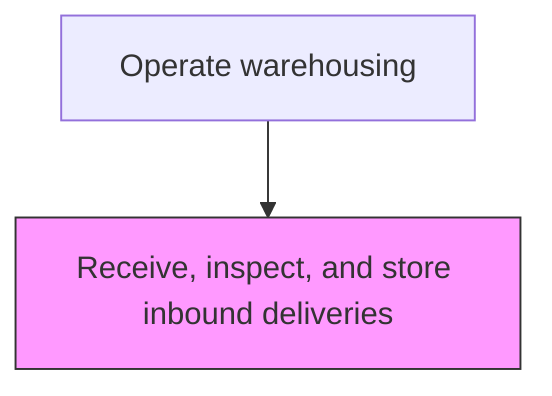
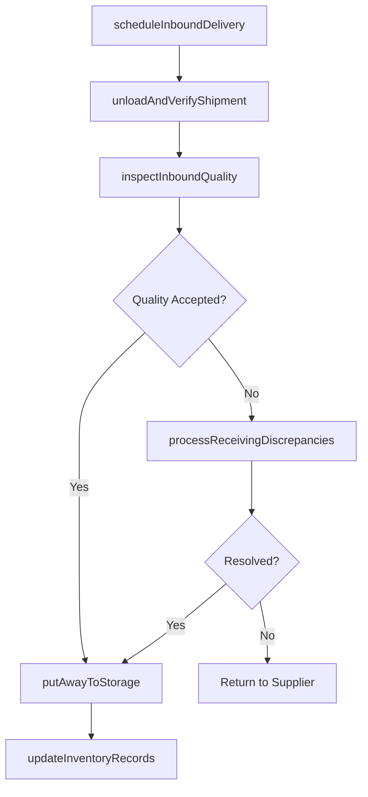

# Receive, inspect, and store inbound deliveries

> Business-as-Code definition for receive, inspect, and store inbound deliveries. Models the warehousing processes to ensure efficient movement, storage, and compliance of goods throughout the supply chain.

## Overview

Coordinating the incoming inbound materials/products. Accept the delivery of these materials and the subsequent storage. Track them at the warehouse/distribution center.

## Process Hierarchy



## GraphDL

```yaml
receive,:
  object: Inspect, And Store Inbound Deliveries
  actor: WarehouseManager
  result: Receive,Output
```

## Actions

| Action | Description |
|--------|-------------|
| scheduleInboundDelivery | Coordinate delivery appointment windows with carriers and dock scheduling |
| unloadAndVerifyShipment | Physically unload goods and verify quantities against advance ship notice (ASN) or PO |
| inspectInboundQuality | Perform quality checks on received goods per incoming inspection standards |
| putAwayToStorage | Assign and move accepted goods to designated storage locations |
| processReceivingDiscrepancies | Document and resolve shortages, damages, or quality rejections |
| updateInventoryRecords | Post received quantities to warehouse management and ERP systems |

## Events

| Event | Description |
|-------|-------------|
| inboundDeliveryScheduled | Carrier delivery appointment confirmed and dock assigned |
| shipmentUnloadedAndVerified | Goods unloaded and quantity verification completed |
| inboundQualityInspected | Incoming quality inspection completed with pass/fail result |
| goodsPutAwayToStorage | Accepted goods moved to assigned storage locations |
| receivingDiscrepanciesProcessed | Shortages, damages, or rejections documented and escalated |
| inventoryRecordsUpdated | WMS and ERP inventory records updated with received quantities |

## Searches

| Search | Description |
|--------|-------------|
| getInboundSchedule | Retrieve scheduled inbound deliveries by date, carrier, or dock |
| findPendingReceipts | List expected deliveries not yet received against open POs |
| getReceivingDiscrepancies | Query unresolved receiving discrepancies by type or supplier |
| getStorageUtilization | Retrieve storage location availability and utilization rates |

## Process Flow



## RACI Matrix

| Activity | Responsible | Accountable | Consulted | Informed |
|----------|-------------|-------------|-----------|----------|
| scheduleInboundDelivery | ReceivingCoordinator | WarehouseManager | TransportationPlanner | Procurement |
| unloadAndVerifyShipment | ReceivingClerk | WarehouseManager | DockSupervisor | SupplyChainPlanner |
| inspectInboundQuality | QualityInspector | QualityManager | Procurement | WarehouseManager |
| putAwayToStorage | WarehouseAssociate | WarehouseManager | InventoryController | ReceivingCoordinator |
| updateInventoryRecords | InventoryController | WarehouseManager | ITSystems | Finance |

## Related Processes

| Process | Relationship |
|---------|-------------|
| 4.4.1 Provide logistics governance | Upstream - governance policies guide logistics operations |
| 4.1.6 Plan distribution requirements | Upstream - distribution plans drive logistics execution |
| 4.4.3 Operate warehousing | Parent process |

## Related Departments

| Department | Role |
|-----------|------|
| Logistics | Primary owner of logistics operations |
| Warehousing | Manages storage, picking, and staging operations |
| Transportation | Handles carrier management and shipment execution |
| Customer Service | Communicates delivery status to customers |

## Related Occupations

| Occupation | Involvement |
|-----------|-------------|
| WarehouseManager | Leads warehousing operations |
| Logistics Coordinator | Coordinates daily logistics activities |
| Warehouse Associate | Executes physical warehouse operations |

## KPIs

| KPI | Description | Unit |
|-----|-------------|------|
| On-Time Performance | Percentage of warehousing activities completed on schedule | % |
| Cost Per Unit | Average logistics cost per unit for warehousing | USD/Unit |
| Exception Rate | Frequency of exceptions in warehousing operations | Count/Week |

## Usage

```typescript
import { receive,Inspect,AndStoreInboundDeliveries } from '@headlessly/receive-inspect-and-store-inbound-deliveries'

const client = receive,Inspect,AndStoreInboundDeliveries()

// Assess requirements for logistics activity
const requirements = await client.assessRequirements({
  activityType: 'warehousing',
  scope: 'inspect,-and-store-inbound-del',
  period: '2025-08'
})

// Coordinate execution with partners
const execution = await client.coordinateExecution({
  requirementsId: requirements.id,
  partners: ['carrier-a', 'warehouse-east']
})
```
