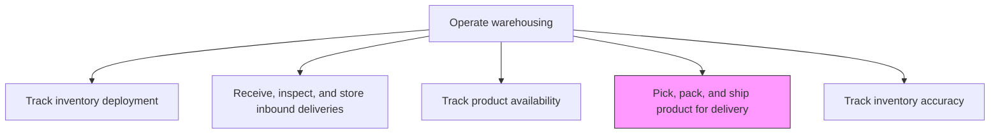
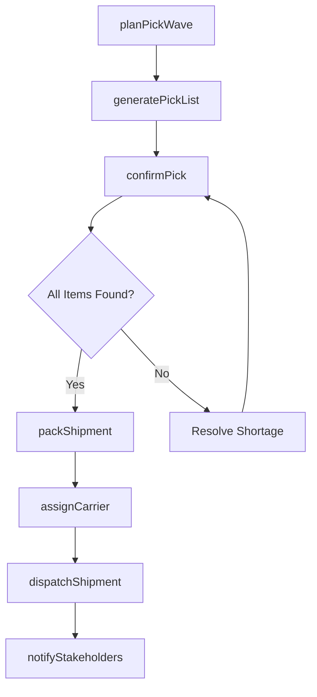

# Pick, pack, and ship product for delivery

> Business-as-Code definition for warehouse order fulfillment. Models the complete pick-pack-ship workflow including wave planning, pick path optimization, packing verification, carrier selection, and shipment dispatch.

## Overview

Packing and shipping the product to deliver to the customer. Take care of the internal and external packaging of the products in order to ensure safe transportation of the products from the warehouse to delivery locations. Notify the ERP system and/or Accounts Receivable Dept.

## Process Hierarchy



## GraphDL

```yaml
pickPackShip:
  object: Product For Delivery
  actor: WarehouseOperator
  result: ShippedConsignment
```

## Actions

| Action | Description |
|--------|-------------|
| planPickWave | Group orders into pick waves based on priority, zone, and carrier cutoff |
| generatePickList | Create optimized pick path instructions for warehouse associates |
| confirmPick | Verify picked items match order line items via barcode or RFID scan |
| packShipment | Select appropriate packaging, apply labels, and secure products |
| assignCarrier | Select shipping carrier and service level based on delivery requirements |
| dispatchShipment | Release packed shipment to carrier and generate tracking number |
| notifyStakeholders | Send shipment confirmation to customer, ERP, and accounts receivable |

## Events

| Event | Description |
|-------|-------------|
| pickWavePlanned | Orders grouped into a pick wave for processing |
| pickListGenerated | Optimized pick instructions created for warehouse floor |
| itemsPicked | All line items for an order physically retrieved from bins |
| shipmentPacked | Order packed, labeled, and ready for dispatch |
| carrierAssigned | Shipping carrier and service level selected |
| shipmentDispatched | Consignment handed off to carrier with tracking |
| stakeholdersNotified | Shipment confirmation sent to all relevant parties |

## Searches

| Search | Description |
|--------|-------------|
| findOrdersReadyToPick | List orders cleared for picking, filtered by priority or zone |
| getPickWaveStatus | Retrieve progress of an active pick wave |
| getShipmentTracking | Look up tracking and carrier details for a dispatched shipment |
| findPackingExceptions | List shipments with packing errors or holds |

## Process Flow



## RACI Matrix

| Activity | Responsible | Accountable | Consulted | Informed |
|----------|-------------|-------------|-----------|----------|
| planPickWave | WarehousePlanner | WarehouseManager | ShippingSupervisor | CustomerService |
| confirmPick | WarehouseAssociate | WarehouseSupervisor | InventoryControl | QualityTeam |
| packShipment | PackingOperator | ShippingSupervisor | QualityTeam | WarehouseManager |
| dispatchShipment | ShippingClerk | ShippingSupervisor | CarrierRep | AccountsReceivable |

## Related Processes

| Process | Relationship |
|---------|-------------|
| 4.4.3 Operate warehousing | Parent process |
| 4.4.3.3 Track product availability | Upstream - availability confirms items are in stock |
| 4.4.4.1 Plan, transport, and deliver outbound product | Downstream - dispatched shipments enter outbound transport |
| 4.4.3.5 Track inventory accuracy | Parallel - picking triggers inventory adjustments |

## Related Departments

| Department | Role |
|-----------|------|
| Warehouse Operations | Executes pick, pack, and ship activities |
| Shipping | Manages carrier relationships and dispatch |
| Customer Service | Communicates delivery status to customers |
| Finance | Receives shipment confirmation for invoicing |

## Related Occupations

| Occupation | Involvement |
|-----------|-------------|
| Warehouse Associate | Picks and packs orders on the floor |
| Shipping Coordinator | Assigns carriers and manages dispatch |
| Warehouse Manager | Oversees fulfillment operations and throughput |

## KPIs

| KPI | Description | Unit |
|-----|-------------|------|
| Order Pick Accuracy | Percentage of orders picked without errors | % |
| Pick-to-Ship Cycle Time | Average time from pick wave release to carrier dispatch | Hours |
| Perfect Order Rate | Percentage of orders shipped complete, on time, damage-free | % |
| Units Per Hour | Average items picked and packed per labor hour | Units/Hour |

## Usage

```typescript
import { pickPackAndShipProductForDelivery } from '@headlessly/pick-pack-and-ship-product-for-delivery'

const fulfillment = pickPackAndShipProductForDelivery()

// Plan a new pick wave for priority orders
const wave = await fulfillment.planPickWave({
  warehouseId: 'WH-EAST-01',
  priority: 'express',
  carrierCutoff: '2024-11-15T16:00:00Z'
})

// Generate pick list for the wave
const pickList = await fulfillment.generatePickList({
  waveId: wave.id,
  optimizeFor: 'shortestPath'
})

// Dispatch completed shipment
await fulfillment.dispatchShipment({
  orderId: 'ORD-88321',
  carrierId: 'FEDEX',
  serviceLevel: 'ground'
})
```
