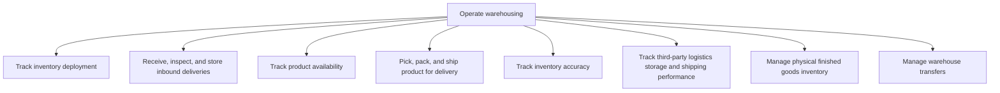
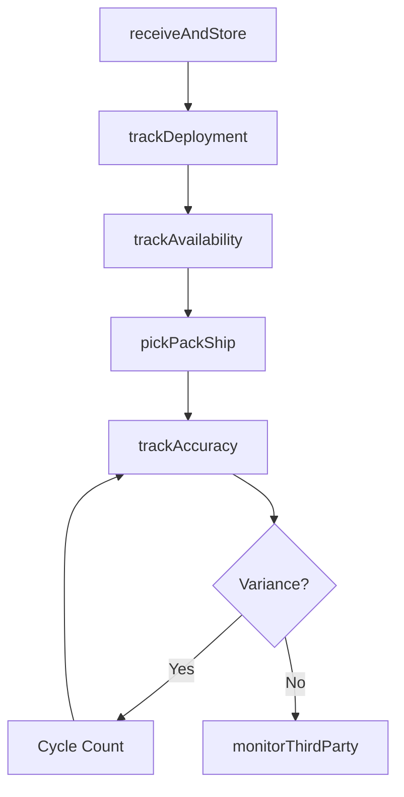

# Operate warehousing

> Business-as-Code definition for warehouse operations. Models inventory tracking, receiving, picking, packing, shipping, accuracy management, 3PL oversight, and inter-warehouse transfers as programmable workflows.

## Overview

Tracking the inventory deployment. Accept and store products. Ship the products. Measure the accuracy of the inventory. Assess the performance of the outsourced logistics activities.

## Process Hierarchy



## GraphDL

```yaml
operate:
  object: Warehousing
  actor: WarehouseManager
  result: ShippedOrder
```

## Actions

| Action | Description |
|--------|-------------|
| trackDeployment | Monitor inventory allocation across distribution points |
| receiveAndStore | Accept, inspect, and put away inbound deliveries |
| trackAvailability | Monitor real-time product availability by location |
| pickPackShip | Execute order fulfillment from pick to dispatch |
| trackAccuracy | Reconcile physical inventory against system records |
| monitorThirdParty | Track 3PL partner storage and shipping performance |
| manageFinishedGoods | Administer physical finished goods inventory |
| manageTransfers | Execute inter-warehouse stock transfers |

## Events

| Event | Description |
|-------|-------------|
| deploymentTracked | Inventory allocation updated across locations |
| deliveryStored | Inbound delivery received, inspected, and put away |
| availabilityUpdated | Product availability refreshed in real time |
| orderShipped | Customer order picked, packed, and dispatched |
| accuracyVerified | Physical count reconciled with system records |
| thirdPartyMonitored | 3PL performance metrics reviewed |
| finishedGoodsManaged | Finished goods inventory levels adjusted |
| transferCompleted | Inter-warehouse stock transfer executed |

## Searches

| Search | Description |
|--------|-------------|
| getInventoryByLocation | Query stock levels by warehouse, zone, or bin |
| findAvailableStock | Check product availability for order fulfillment |
| getShipmentQueue | List orders in pick-pack-ship pipeline |
| getInventoryAccuracy | Retrieve inventory accuracy metrics by location |
| get3PLPerformance | Query third-party logistics provider metrics |

## Process Flow



## RACI Matrix

| Activity | Responsible | Accountable | Consulted | Informed |
|----------|-------------|-------------|-----------|----------|
| receiveAndStore | ReceivingClerk | WarehouseManager | QA | Procurement |
| pickPackShip | WarehouseOperator | WarehouseManager | Sales | Transportation |
| trackAccuracy | InventoryController | WarehouseManager | Finance | Operations |
| manageTransfers | TransferCoordinator | WarehouseManager | Logistics | Finance |

## Sub-Processes

| ID | Name | Description |
|----|------|-------------|
| 4.4.3.1 | Track inventory deployment | Tracking the logistical act of delivering or releasing an inventory item or entity to targeted end u |
| 4.4.3.2 | Receive, inspect, and store inbound deliveries | Coordinating the incoming inbound materials/products. Accept the delivery of these materials and the |
| 4.4.3.3 | Track product availability | Keeping track of the availability of different materials/products at the warehouse and distribution  |
| 4.4.3.4 | Pick, pack, and ship product for delivery | Packing and shipping the product to deliver to the customer. Take care of the internal and external  |
| 4.4.3.5 | Track inventory accuracy | Monitoring any discrepancies between electronic records that represent the inventory and the physica |
| 4.4.3.6 | Track third-party logistics storage and shipping performance | Keeping a track on the storage and shipping performance of third-party agencies. Monitor logistics s |
| 4.4.3.7 | Manage physical finished goods inventory | Administering the movement of the finished products that are processed by the organization through i |
| 4.4.3.8 | Manage warehouse transfers | Shipping items from one warehouse to another in a multi-warehouse environment. A warehouse transfer  |

## Related Processes

| Process | Relationship |
|---------|-------------|
| 4.4.2 Plan and manage inbound material flow | Upstream - received materials enter warehouse |
| 4.4.4 Operate outbound transportation | Downstream - shipped orders move to carriers |
| 4.3.4 Maintain production records | Upstream - lot data accompanies inventory |

## Related Departments

| Department | Role |
|-----------|------|
| Warehousing | Primary owner of storage and fulfillment operations |
| Inventory Control | Manages accuracy and cycle counting |
| IT | Maintains warehouse management system |
| Transportation | Coordinates outbound shipping |

## Related Occupations

| Occupation | Involvement |
|-----------|-------------|
| Warehouse Manager | Operations management and staff coordination |
| Inventory Controller | Stock accuracy and cycle count management |
| Warehouse Operator | Pick, pack, and ship execution |

## KPIs

| KPI | Description | Unit |
|-----|-------------|------|
| Order Fulfillment Rate | Percentage of orders shipped complete and on time | % |
| Inventory Accuracy | Agreement between system records and physical counts | % |
| Warehouse Throughput | Units processed per labor hour | Units/Hour |
| Storage Utilization | Percentage of warehouse capacity in use | % |

## Usage

```typescript
import { operateWarehousing } from '@headlessly/operate-warehousing'

const client = operateWarehousing()

// Pick, pack, and ship an order
const shipment = await client.pickPackShip({
  salesOrderId: 'SO-2025-0456',
  warehouse: 'DC-East',
  priority: 'same-day',
  packingInstructions: 'fragile'
})

// Check inventory accuracy
const accuracy = await client.trackAccuracy({
  warehouse: 'DC-East',
  zone: 'A',
  method: 'cycle-count',
  sampleSize: 100
})
```
