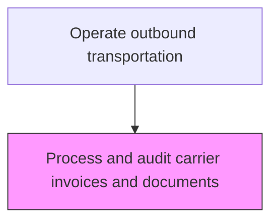
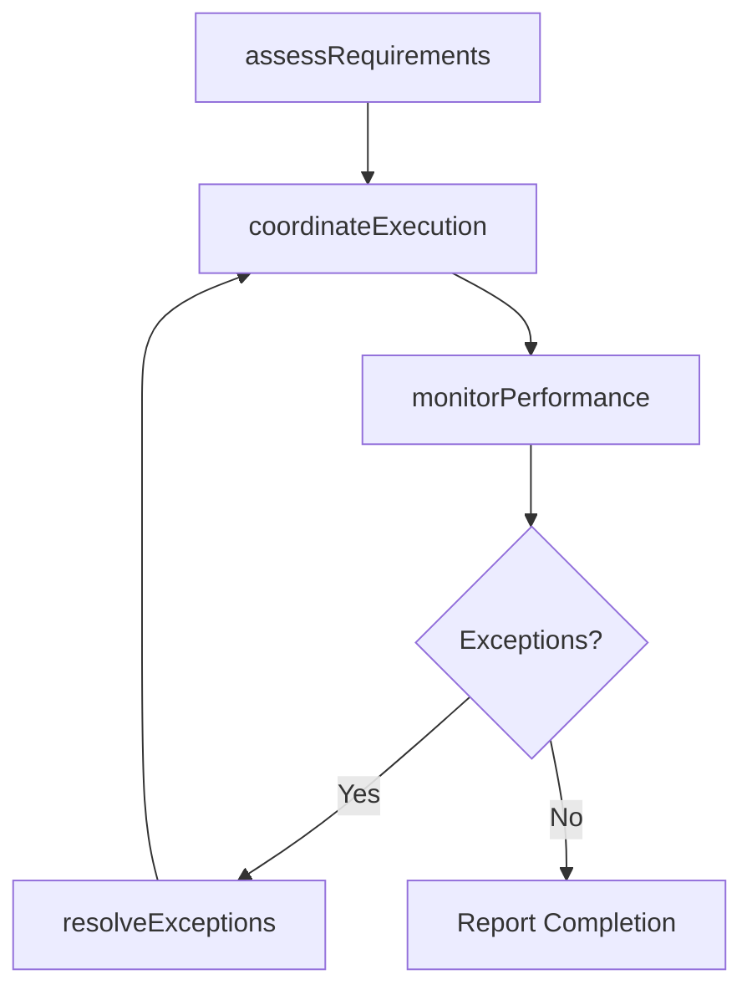

# Process and audit carrier invoices and documents

> Business-as-Code definition for process and audit carrier invoices and documents. Models the outbound transport processes to ensure efficient movement, storage, and compliance of goods throughout the supply chain.

## Overview

Organizing and inspecting all account statements and any other documentation for the carriers used in delivery. Create, manage, and inspect all documents related to the financial, regulatory, and administrative accounts of all the carriers/freights. Generate receipts for all freight transactions.

## Process Hierarchy



## GraphDL

```yaml
process:
  object: And Audit Carrier Invoices And Documents
  actor: TransportationManager
  result: ProcessOutput
```

## Actions

| Action | Description |
|--------|-------------|
| processActivity | Process and audit carrier invoices and documents following established logistics procedures |
| assessRequirements | Evaluate operational requirements for process and audit carrier invoices and documents |
| coordinateExecution | Coordinate logistics activities with internal teams and external partners |
| monitorPerformance | Track performance metrics for outbound transport activities |
| resolveExceptions | Identify and address operational exceptions and delays |

## Events

| Event | Description |
|-------|-------------|
| requirementsAssessed | Operational requirements evaluated for process and audit carrier invoices and documents |
| executionCoordinated | Logistics activities coordinated with all parties |
| performanceMonitored | outbound transport performance metrics updated |
| exceptionsResolved | Operational exceptions identified and addressed |
| activityCompleted | Process and audit carrier invoices and documents completed and documented |

## Searches

| Search | Description |
|--------|-------------|
| getOperationalStatus | Retrieve current status of process and audit carrier invoices and documents activities |
| findExceptions | Identify pending exceptions requiring attention |
| getPerformanceDashboard | Query performance metrics for outbound transport operations |
| getShipmentTracking | Retrieve real-time tracking data for shipments and materials |

## Process Flow



## RACI Matrix

| Activity | Responsible | Accountable | Consulted | Informed |
|----------|-------------|-------------|-----------|----------|
| assessRequirements | TransportationManager | VP Logistics | SupplyChain | Finance |
| coordinateExecution | TransportationManager | VP Logistics | Warehousing, Carriers | CustomerService |
| monitorPerformance | LogisticsAnalyst | VP Logistics | Operations | Executive |

## Related Processes

| Process | Relationship |
|---------|-------------|
| 4.4.1 Provide logistics governance | Upstream - governance policies guide logistics operations |
| 4.1.6 Plan distribution requirements | Upstream - distribution plans drive logistics execution |
| 4.4.3 Operate warehousing | Parallel - warehousing supports logistics flow |

## Related Departments

| Department | Role |
|-----------|------|
| Logistics | Primary owner of logistics operations |
| Warehousing | Manages storage, picking, and staging operations |
| Transportation | Handles carrier management and shipment execution |
| Customer Service | Communicates delivery status to customers |

## Related Occupations

| Occupation | Involvement |
|-----------|-------------|
| TransportationManager | Leads outbound transport operations |
| Logistics Coordinator | Coordinates daily logistics activities |
| Warehouse Associate | Executes physical warehouse operations |

## KPIs

| KPI | Description | Unit |
|-----|-------------|------|
| On-Time Performance | Percentage of outbound transport activities completed on schedule | % |
| Cost Per Unit | Average logistics cost per unit for outbound transport | USD/Unit |
| Exception Rate | Frequency of exceptions in outbound transport operations | Count/Week |

## Usage

```typescript
import { processAndAuditCarrierInvoicesAndDocuments } from '@headlessly/process-and-audit-carrier-invoices-and-documents'

const client = processAndAuditCarrierInvoicesAndDocuments()

// Assess requirements for logistics activity
const requirements = await client.assessRequirements({
  activityType: 'outbound-transport',
  scope: 'and-audit-carrier-invoices-and',
  period: '2025-08'
})

// Coordinate execution with partners
const execution = await client.coordinateExecution({
  requirementsId: requirements.id,
  partners: ['carrier-a', 'warehouse-east']
})
```
