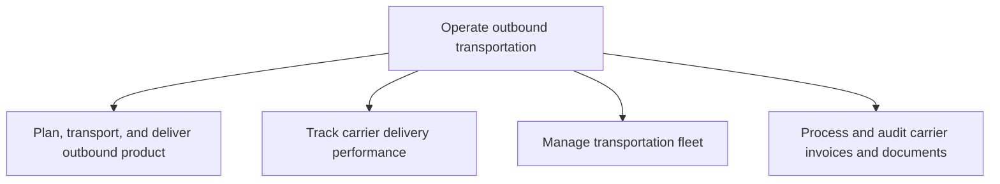
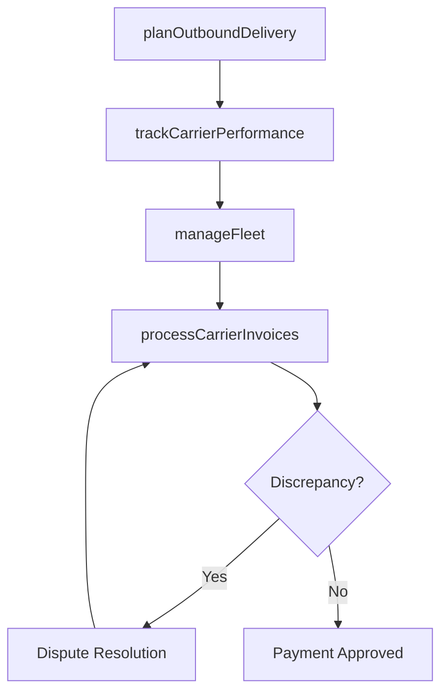

# Operate outbound transportation

> Business-as-Code definition for outbound transportation operations. Models shipment planning, carrier performance tracking, fleet management, and freight invoice processing as programmable workflows.

## Overview

Creating a plan that specifies the schedule and system for transportation and delivery of the outbound products, as well as tracking the performance of the carrier delivery system. Conduct vehicle management and processing of all carrier-related documents.

## Process Hierarchy



## GraphDL

```yaml
operate:
  object: Outbound Transportation
  actor: TransportationManager
  result: DeliveredShipment
```

## Actions

| Action | Description |
|--------|-------------|
| planOutboundDelivery | Schedule routing, carrier selection, and delivery timing |
| trackCarrierPerformance | Monitor on-time delivery and damage rates by carrier |
| manageFleet | Maintain and optimize owned transportation vehicles |
| processCarrierInvoices | Audit and reconcile carrier freight bills and documents |

## Events

| Event | Description |
|-------|-------------|
| outboundDeliveryPlanned | Shipment route and carrier assigned |
| carrierPerformanceTracked | Carrier metrics updated in scorecard |
| fleetManaged | Fleet maintenance and utilization updated |
| carrierInvoicesProcessed | Freight bills audited and approved for payment |

## Searches

| Search | Description |
|--------|-------------|
| getShipmentTracking | Track outbound shipments in transit |
| getCarrierScorecard | Retrieve carrier performance metrics |
| getFreightCosts | Query transportation costs by lane, carrier, or mode |
| findFleetAvailability | Check vehicle availability for shipment scheduling |

## Process Flow



## RACI Matrix

| Activity | Responsible | Accountable | Consulted | Informed |
|----------|-------------|-------------|-----------|----------|
| planOutboundDelivery | ShippingCoordinator | TransportationManager | Sales, Warehouse | Customer |
| trackCarrierPerformance | LogisticsAnalyst | TransportationManager | Procurement | Carriers |
| manageFleet | FleetManager | TransportationManager | Maintenance, Safety | Finance |
| processCarrierInvoices | FreightAuditor | TransportationManager | Finance, Carriers | Procurement |

## Sub-Processes

| ID | Name | Description |
|----|------|-------------|
| 4.4.4.1 | Plan, transport, and deliver outbound product | Organizing the transportation and delivery of outbound products. Plan and organize the transportatio |
| 4.4.4.2 | Track carrier delivery performance | Monitoring delivery performance when carrying products from the warehouse/distribution centers to th |
| 4.4.4.3 | Manage transportation fleet | Taking care of a range of functions related to the means of transport used for delivering the end pr |
| 4.4.4.4 | Process and audit carrier invoices and documents | Organizing and inspecting all account statements and any other documentation for the carriers used i |

## Related Processes

| Process | Relationship |
|---------|-------------|
| 4.4.3 Operate warehousing | Upstream - packed orders ready for carrier pickup |
| 4.4.5 Meet data exchange and legal requirements | Parallel - customs documentation accompanies shipments |
| 6.0 Manage Customer Service | Downstream - delivery status feeds customer inquiries |

## Related Departments

| Department | Role |
|-----------|------|
| Transportation | Primary owner of outbound shipping operations |
| Warehousing | Coordinates dock scheduling for carrier pickup |
| Finance | Processes freight invoices and tracks costs |
| Customer Service | Communicates delivery status to customers |

## Related Occupations

| Occupation | Involvement |
|-----------|-------------|
| Transportation Manager | Carrier management and route optimization |
| Fleet Manager | Vehicle maintenance and utilization |
| Freight Auditor | Invoice verification and cost control |

## KPIs

| KPI | Description | Unit |
|-----|-------------|------|
| On-Time Delivery | Percentage of shipments delivered by promised date | % |
| Freight Cost per Unit | Average transportation cost per shipped unit | Currency |
| Carrier Damage Rate | Percentage of shipments with transit damage | % |
| Fleet Utilization | Percentage of fleet capacity in productive use | % |

## Usage

```typescript
import { operateOutboundTransportation } from '@headlessly/operate-outbound-transportation'

const client = operateOutboundTransportation()

// Plan outbound delivery
const shipment = await client.planOutboundDelivery({
  orderId: 'SO-2025-0456',
  origin: 'DC-East',
  destination: 'customer-address',
  mode: 'LTL',
  requiredDeliveryDate: '2025-05-10'
})

// Track carrier performance
const scorecard = await client.trackCarrierPerformance({
  carrierId: 'CARRIER-XYZ',
  period: 'Q2-2025',
  metrics: ['on-time', 'damage-rate', 'cost-per-mile']
})
```
