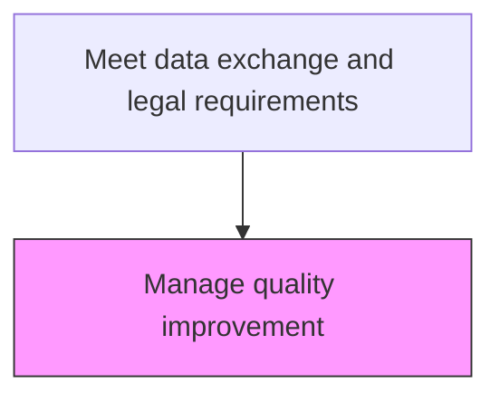
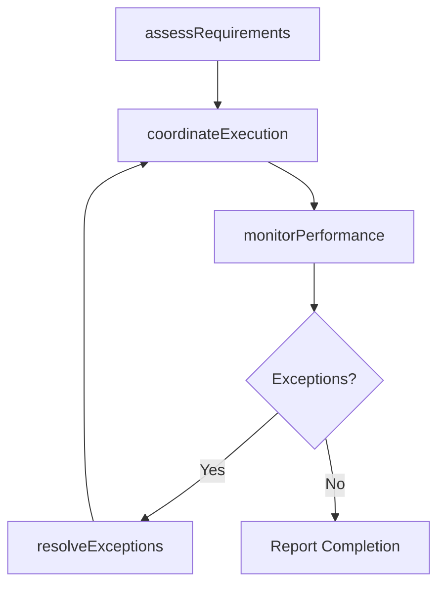

# Manage quality improvement

> Business-as-Code definition for manage quality improvement. Models the trade compliance processes to ensure efficient movement, storage, and compliance of goods throughout the supply chain.

## Overview

Implementing continuous improvement initiatives for logistics quality processes. Apply Lean, Six Sigma, and other quality methodologies to reduce defects, improve service levels, and enhance overall logistics performance.

## Process Hierarchy



## GraphDL

```yaml
manage:
  object: Quality Improvement
  actor: TradeComplianceManager
  result: ManageOutput
```

## Actions

| Action | Description |
|--------|-------------|
| manageActivity | Manage quality improvement following established logistics procedures |
| assessRequirements | Evaluate operational requirements for manage quality improvement |
| coordinateExecution | Coordinate logistics activities with internal teams and external partners |
| monitorPerformance | Track performance metrics for trade compliance activities |
| resolveExceptions | Identify and address operational exceptions and delays |

## Events

| Event | Description |
|-------|-------------|
| requirementsAssessed | Operational requirements evaluated for manage quality improvement |
| executionCoordinated | Logistics activities coordinated with all parties |
| performanceMonitored | trade compliance performance metrics updated |
| exceptionsResolved | Operational exceptions identified and addressed |
| activityCompleted | Manage quality improvement completed and documented |

## Searches

| Search | Description |
|--------|-------------|
| getOperationalStatus | Retrieve current status of manage quality improvement activities |
| findExceptions | Identify pending exceptions requiring attention |
| getPerformanceDashboard | Query performance metrics for trade compliance operations |
| getShipmentTracking | Retrieve real-time tracking data for shipments and materials |

## Process Flow



## RACI Matrix

| Activity | Responsible | Accountable | Consulted | Informed |
|----------|-------------|-------------|-----------|----------|
| assessRequirements | TradeComplianceManager | VP Logistics | SupplyChain | Finance |
| coordinateExecution | TradeComplianceManager | VP Logistics | Warehousing, Carriers | CustomerService |
| monitorPerformance | LogisticsAnalyst | VP Logistics | Operations | Executive |

## Related Processes

| Process | Relationship |
|---------|-------------|
| 4.4.1 Provide logistics governance | Upstream - governance policies guide logistics operations |
| 4.1.6 Plan distribution requirements | Upstream - distribution plans drive logistics execution |
| 4.4.3 Operate warehousing | Parallel - warehousing supports logistics flow |

## Related Departments

| Department | Role |
|-----------|------|
| Logistics | Primary owner of logistics operations |
| Warehousing | Manages storage, picking, and staging operations |
| Transportation | Handles carrier management and shipment execution |
| Customer Service | Communicates delivery status to customers |

## Related Occupations

| Occupation | Involvement |
|-----------|-------------|
| TradeComplianceManager | Leads trade compliance operations |
| Logistics Coordinator | Coordinates daily logistics activities |
| Warehouse Associate | Executes physical warehouse operations |

## KPIs

| KPI | Description | Unit |
|-----|-------------|------|
| On-Time Performance | Percentage of trade compliance activities completed on schedule | % |
| Cost Per Unit | Average logistics cost per unit for trade compliance | USD/Unit |
| Exception Rate | Frequency of exceptions in trade compliance operations | Count/Week |

## Usage

```typescript
import { manageQualityImprovement } from '@headlessly/manage-quality-improvement'

const client = manageQualityImprovement()

// Assess requirements for logistics activity
const requirements = await client.assessRequirements({
  activityType: 'trade-compliance',
  scope: 'quality-improvement',
  period: '2025-08'
})

// Coordinate execution with partners
const execution = await client.coordinateExecution({
  requirementsId: requirements.id,
  partners: ['carrier-a', 'warehouse-east']
})
```
