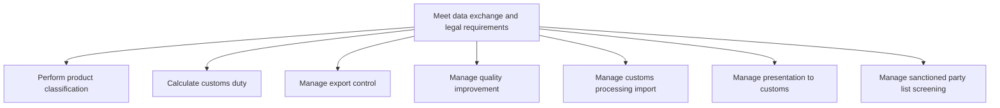
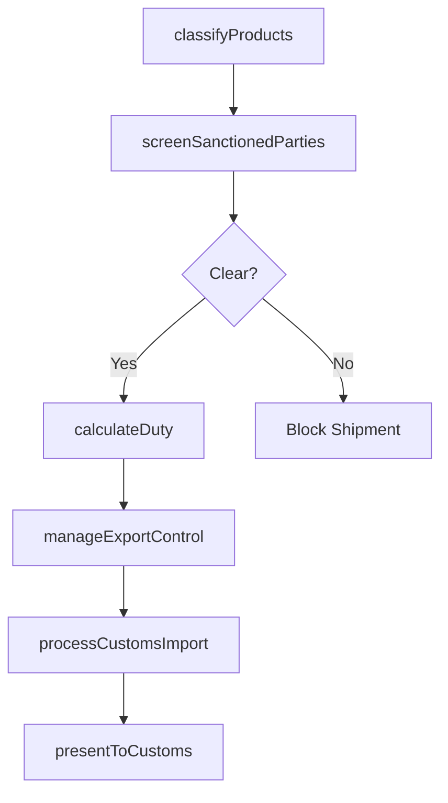

# Meet data exchange and legal requirements

> Business-as-Code definition for trade compliance and legal requirements. Models product classification, customs duty calculation, export control, import processing, and sanctioned party screening as programmable workflows.

## Overview

Ensuring compliance with international trade regulations and data exchange requirements. Classify products under harmonized tariff schedules, calculate applicable customs duties, manage export controls and restricted party screening, process import customs declarations, and maintain quality improvement programs related to trade compliance.

## Process Hierarchy



## GraphDL

```yaml
meet:
  object: Data Exchange And Legal Requirements
  actor: TradeComplianceOfficer
  result: ComplianceClearance
```

## Actions

| Action | Description |
|--------|-------------|
| classifyProducts | Assign harmonized tariff codes to products |
| calculateDuty | Compute customs duties and taxes for shipments |
| manageExportControl | Screen shipments against export control regulations |
| processCustomsImport | File import customs declarations and documentation |
| screenSanctionedParties | Verify trading partners against restricted party lists |
| manageQualityImprovement | Improve compliance processes based on audit findings |
| presentToCustoms | Prepare and submit documentation for customs review |

## Events

| Event | Description |
|-------|-------------|
| productsClassified | Tariff classification completed for product catalog |
| dutyCalculated | Customs duty computed for shipment |
| exportControlCleared | Shipment cleared against export restrictions |
| customsImportProcessed | Import declaration filed and accepted |
| sanctionedPartyScreened | Trading partner screened against restricted lists |
| qualityImproved | Compliance process improvement implemented |
| customsPresentationComplete | Documentation submitted to customs authority |

## Searches

| Search | Description |
|--------|-------------|
| getTariffClassification | Retrieve tariff codes for products |
| getDutyEstimate | Calculate estimated duties for a planned shipment |
| getScreeningResults | Query sanctioned party screening results |
| getComplianceStatus | Check compliance status for pending shipments |

## Process Flow



## RACI Matrix

| Activity | Responsible | Accountable | Consulted | Informed |
|----------|-------------|-------------|-----------|----------|
| classifyProducts | TradeComplianceAnalyst | TradeComplianceOfficer | Product, Legal | Logistics |
| screenSanctionedParties | ComplianceScreener | TradeComplianceOfficer | Legal | Sales |
| calculateDuty | CustomsBroker | TradeComplianceOfficer | Finance | Logistics |
| manageExportControl | ExportControlSpecialist | TradeComplianceOfficer | Legal, Government | Executive |

## Sub-Processes

| ID | Name | Description |
|----|------|-------------|
| 4.4.5.1 | Perform product classification | Perform product classification within the supply chain to ensure operational efficiency and alignment with organizational objectives |
| 4.4.5.2 | Calculate customs duty | Calculate customs duty within the supply chain to ensure operational efficiency and alignment with organizational objectives |
| 4.4.5.3 | Manage export control | Manage export control within the supply chain to ensure operational efficiency and alignment with organizational objectives |
| 4.4.5.4 | Manage quality improvement | Manage quality improvement within the supply chain to ensure operational efficiency and alignment with organizational objectives |
| 4.4.5.5 | Manage customs processing import | Manage customs processing import within the supply chain to ensure operational efficiency and alignment with organizational objectives |
| 4.4.5.6 | Manage presentation to customs | Manage presentation to customs within the supply chain to ensure operational efficiency and alignment with organizational objectives |
| 4.4.5.7 | Manage sanctioned party list screening | Manage sanctioned party list screening within the supply chain to ensure operational efficiency and alignment with organizational objectives |

## Related Processes

| Process | Relationship |
|---------|-------------|
| 4.4.4 Operate outbound transportation | Parallel - compliance required before shipment |
| 4.4.2 Plan and manage inbound material flow | Parallel - import compliance for inbound goods |
| 12.0 Manage external relationships | Upstream - regulatory requirements drive compliance |

## Related Departments

| Department | Role |
|-----------|------|
| Trade Compliance | Primary owner of customs and export control |
| Legal | Regulatory guidance and sanctions interpretation |
| Logistics | Executes compliant shipping operations |
| Finance | Manages duty payments and trade finance |

## Related Occupations

| Occupation | Involvement |
|-----------|-------------|
| Trade Compliance Officer | Overall compliance program management |
| Customs Broker | Duty calculation and declaration filing |
| Export Control Specialist | Restricted party screening and licensing |

## KPIs

| KPI | Description | Unit |
|-----|-------------|------|
| Compliance Rate | Percentage of shipments passing all compliance checks | % |
| Customs Clearance Time | Average time from filing to customs release | Hours |
| Screening Accuracy | Percentage of sanctioned party screenings without false positives | % |
| Duty Optimization | Savings from proper tariff classification and trade programs | Currency |

## Usage

```typescript
import { meetDataExchangeAndLegalRequirements } from '@headlessly/meet-data-exchange-and-legal-requirements'

const client = meetDataExchangeAndLegalRequirements()

// Screen trading partner
const screening = await client.screenSanctionedParties({
  partyName: 'Global Trading Corp',
  country: 'DE',
  lists: ['SDN', 'EU-sanctions', 'denied-persons']
})

// Calculate customs duty
const duty = await client.calculateDuty({
  productId: 'SKU-5500',
  originCountry: 'CN',
  destinationCountry: 'US',
  quantity: 1000,
  declaredValue: 50000
})
```
