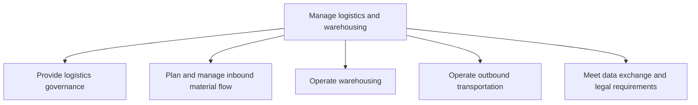
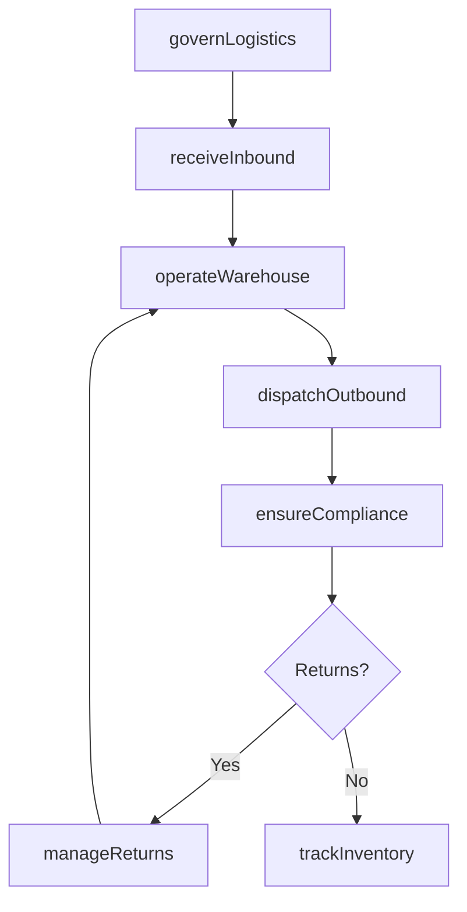

# Manage logistics and warehousing

> Business-as-Code definition for logistics and warehousing management. Models inbound material flow, warehouse operations, outbound transportation, reverse logistics, and trade compliance as programmable workflows.

## Overview

Administering and overseeing all activities related to logistics and warehousing. Outline and establish a strategy for the logistics function. Plan and administer the flow of inbound materials. Administer the operational activities of warehousing and outbound transportation. Manage reverse logistics including returns and exchanges.

## Process Hierarchy



## GraphDL

```yaml
manage:
  object: Logistics And Warehousing
  actor: LogisticsManager
  result: FulfilledShipment
```

## Actions

| Action | Description |
|--------|-------------|
| governLogistics | Define logistics network design, KPIs, and service policies |
| receiveInbound | Plan and manage inbound material receipts and inspections |
| operateWarehouse | Execute receiving, put-away, picking, packing, and shipping |
| dispatchOutbound | Plan, route, and deliver outbound shipments to customers |
| manageReturns | Process returned products through reverse logistics channels |
| ensureCompliance | Classify products, calculate duties, and manage customs processing |
| trackInventory | Monitor inventory deployment, accuracy, and availability |

## Events

| Event | Description |
|-------|-------------|
| logisticsGoverned | Logistics network design and policies established |
| inboundReceived | Inbound materials received, inspected, and stored |
| warehouseOperated | Warehouse pick-pack-ship cycle completed |
| outboundDispatched | Outbound shipment loaded and dispatched to carrier |
| returnProcessed | Returned product inspected and routed for disposition |
| complianceMet | Trade compliance checks passed and documentation filed |
| inventoryTracked | Inventory count reconciled and accuracy verified |

## Searches

| Search | Description |
|--------|-------------|
| getShipmentStatus | Track inbound or outbound shipment by tracking number or order |
| findInventoryByLocation | Query inventory levels by warehouse, zone, or bin location |
| getCarrierPerformance | Retrieve carrier delivery performance and cost metrics |
| findReturnOrders | List return orders by customer, reason, or status |
| getComplianceDocuments | Retrieve customs declarations and export control documents |

## Process Flow



## RACI Matrix

| Activity | Responsible | Accountable | Consulted | Informed |
|----------|-------------|-------------|-----------|----------|
| governLogistics | LogisticsDirector | VP SupplyChain | Finance, Sales | Executive |
| receiveInbound | WarehouseManager | LogisticsDirector | Procurement, QA | Production |
| operateWarehouse | WarehouseSupervisor | WarehouseManager | IT, Operations | Finance |
| dispatchOutbound | TransportationManager | LogisticsDirector | Sales, CustomerService | Finance |
| ensureCompliance | TradeComplianceOfficer | Legal | Customs, Logistics | Executive |

## Sub-Processes

| ID | Name | Description |
|----|------|-------------|
| 4.4.1 | Provide logistics governance | Outlining the strategy for managing logistics. Translate customer requirements logistic requirements |
| 4.4.2 | Plan and manage inbound material flow | Creating and executing a strategy for all the internal activities related to the flow/transfer of in |
| 4.4.3 | Operate warehousing | Tracking the inventory deployment. Accept and store products. Ship the products. Measure the accurac |
| 4.4.4 | Operate outbound transportation | Creating a plan that specifies the schedule and system for transportation and delivery of the outbou |
| 4.4.5 | Meet data exchange and legal requirements | Meet data exchange and legal requirements within the supply chain to ensure operational efficiency and alignment with organizational objectives |

## Related Processes

| Process | Relationship |
|---------|-------------|
| 4.3 Produce/Assemble/Test product | Upstream - finished goods enter warehouse from production |
| 4.1.6 Plan distribution requirements | Upstream - distribution plan drives logistics execution |
| 6.0 Manage Customer Service | Downstream - delivery issues trigger customer service cases |
| 3.5 Manage customer orders | Parallel - order fulfillment drives outbound logistics |

## Related Departments

| Department | Role |
|-----------|------|
| Logistics | Primary owner of transportation and distribution |
| Warehousing | Manages receiving, storage, and shipping operations |
| Trade Compliance | Ensures customs and export control adherence |
| Customer Service | Handles delivery exceptions and return authorizations |
| IT | Maintains warehouse management and tracking systems |

## Related Occupations

| Occupation | Involvement |
|-----------|-------------|
| Logistics Manager | Transportation planning and carrier management |
| Warehouse Manager | Warehouse operations and inventory control |
| Trade Compliance Specialist | Customs and export documentation |
| Fleet Manager | Vehicle fleet operations and route optimization |

## KPIs

| KPI | Description | Unit |
|-----|-------------|------|
| On-Time Shipment Rate | Percentage of orders shipped by promised date | % |
| Warehouse Throughput | Units processed per labor hour in warehouse | Units/Hour |
| Inventory Accuracy | Agreement between physical count and system records | % |
| Freight Cost per Unit | Average transportation cost per unit shipped | Currency |
| Order Fill Rate | Percentage of order lines fulfilled from available stock | % |

## Usage

```typescript
import { manageLogisticsAndWarehousing } from '@headlessly/manage-logistics-and-warehousing'

const client = manageLogisticsAndWarehousing()

// Receive inbound materials
const receipt = await client.receiveInbound({
  purchaseOrderId: 'PO-2025-1234',
  deliveryNote: 'DN-56789',
  inspectionRequired: true
})

// Pick, pack, and ship an order
const shipment = await client.operateWarehouse({
  salesOrderId: 'SO-2025-0456',
  operation: 'pick-pack-ship',
  priority: 'standard'
})

// Track outbound delivery
const tracking = await client.getShipmentStatus({
  trackingNumber: shipment.trackingNumber,
  carrier: shipment.carrier
})
```
