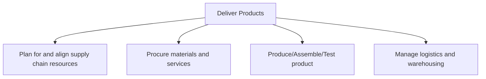
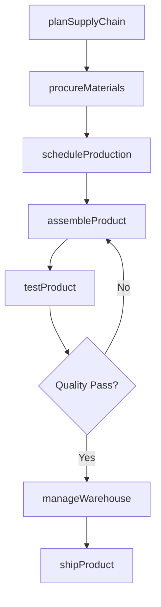

# Deliver Products

> Business-as-Code definition for end-to-end product delivery. Models supply chain planning, procurement, production, and logistics as programmable workflows.

## Overview

Performing supply chain activities include planning supply chain, procuring materials and services, and managing logistics.

## Process Hierarchy



## GraphDL

```yaml
deliver:
  object: Products
  actor: SupplyChainManager
  result: DeliveredProduct
```

## Actions

| Action | Description |
|--------|-------------|
| planSupplyChain | Develop integrated supply chain resource plans aligned with demand |
| procureMaterials | Source and acquire raw materials and services from suppliers |
| scheduleProduction | Create and manage master production schedules |
| assembleProduct | Execute manufacturing and assembly operations |
| testProduct | Perform quality testing and validation of finished goods |
| manageWarehouse | Operate warehousing, inventory, and storage operations |
| shipProduct | Execute outbound transportation and delivery to customers |

## Events

| Event | Description |
|-------|-------------|
| supplyChainPlanned | Supply chain resource plan finalized and approved |
| materialsProcured | Materials and services sourced and received |
| productionScheduled | Master production schedule created and released |
| productAssembled | Product manufactured and assembly completed |
| productTested | Quality testing completed and results recorded |
| productShipped | Finished goods dispatched to customer or distribution center |
| deliveryConfirmed | Customer receipt of product confirmed |

## Searches

| Search | Description |
|--------|-------------|
| getProductionStatus | Retrieve current production order status and progress |
| findInventoryLevels | Query inventory levels by product, location, or warehouse |
| getShipmentTracking | Track outbound shipments and delivery status |
| findSupplierOrders | List purchase orders by supplier, material, or status |
| getQualityMetrics | Retrieve quality test results and defect rates |

## Process Flow



## RACI Matrix

| Activity | Responsible | Accountable | Consulted | Informed |
|----------|-------------|-------------|-----------|----------|
| planSupplyChain | SupplyChainPlanner | VP Operations | Finance, Sales | Executive |
| procureMaterials | ProcurementManager | CPO | Engineering, Legal | Finance |
| scheduleProduction | ProductionPlanner | PlantManager | SupplyChain, Sales | Operations |
| assembleProduct | ProductionSupervisor | PlantManager | QualityTeam | SupplyChain |
| shipProduct | LogisticsCoordinator | VP Logistics | Sales, CustomerService | Finance |

## Sub-Processes

| ID | Name | Description |
|----|------|-------------|
| 4.1 | Plan for and align supply chain resources | Creating strategies for production and materials. Handle the demand for the products of the organiza |
| 4.2 | Procure materials and services | Creating a plan for procuring materials and services. Develop strategies for sourcing materials and  |
| 4.3 | Produce/Assemble/Test product | Processing and delivering the finished goods manufactured by the organization. Schedule the producti |
| 4.4 | Manage logistics and warehousing | Administering and overseeing all activities related to logistics and warehousing. Outline and establ |

## Related Processes

| Process | Relationship |
|---------|-------------|
| 3.0 Market and Sell Products and Services | Upstream - demand signals drive production planning |
| 5.0 Deliver Services | Parallel - shared logistics and customer delivery |
| 8.0 Manage Financial Resources | Downstream - production costs feed financial reporting |

## Related Departments

| Department | Role |
|-----------|------|
| Supply Chain | Primary owner of planning and coordination |
| Procurement | Manages sourcing, supplier selection, and purchasing |
| Manufacturing | Executes production, assembly, and testing |
| Logistics | Operates warehousing, transportation, and delivery |
| Quality Assurance | Ensures product conformance to standards |

## Related Occupations

| Occupation | Involvement |
|-----------|-------------|
| Supply Chain Manager | End-to-end supply chain orchestration |
| Procurement Specialist | Supplier management and purchasing |
| Production Manager | Manufacturing operations oversight |
| Logistics Coordinator | Warehousing and transportation execution |

## KPIs

| KPI | Description | Unit |
|-----|-------------|------|
| Perfect Order Rate | Percentage of orders delivered complete, on-time, damage-free, and accurately documented | % |
| Order Cycle Time | Average time from order receipt to customer delivery | Days |
| Inventory Turnover | Number of times inventory is sold and replaced per period | Turns/Year |
| Manufacturing Yield | Percentage of production output meeting quality standards | % |
| Supply Chain Cost | Total cost of supply chain operations as percentage of revenue | % of Revenue |

## Usage

```typescript
import { deliverProducts } from '@headlessly/deliver-products'

const client = deliverProducts()

// Plan supply chain resources
const plan = await client.planSupplyChain({
  demandForecast: 'Q3-2025',
  productLine: 'electronics',
  region: 'North America'
})

// Track production and shipment status
const status = await client.getProductionStatus({
  orderId: 'PO-2025-1234',
  includeQualityResults: true
})

// Ship finished goods
const shipment = await client.shipProduct({
  productId: status.productId,
  warehouse: 'DC-East',
  carrier: 'freight-standard',
  destination: 'customer-address'
})
```
