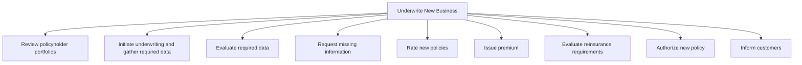

# Underwrite New Business

> TODO: Business-as-Code definition for underwrite new business (property-and-casualty-insurance)

## Overview

TODO: Add process overview

## Process Hierarchy



## GraphDL

```yaml
underwrite:
  object: New Business
  actor: TODO
  result: TODO
```

## Actions

| Action | Description |
|--------|-------------|
| TODO | TODO |

## Events

| Event | Description |
|-------|-------------|
| TODO | TODO |

## Searches

| Search | Description |
|--------|-------------|
| TODO | TODO |

## Process Flow


## RACI Matrix

| Activity | Responsible | Accountable | Consulted | Informed |
|----------|-------------|-------------|-----------|----------|
| TODO | TODO | TODO | TODO | TODO |

## Sub-Processes

| ID | Name | Description |
|----|------|-------------|
| 4.3.1.2.1 | Review policyholder portfolios | TODO |
| 4.3.1.2.2 | Initiate underwriting and gather required data | TODO |
| 4.3.1.2.3 | Evaluate required data | TODO |
| 4.3.1.2.4 | Request missing information | TODO |
| 4.3.1.2.5 | Rate new policies | TODO |
| 4.3.1.2.6 | Issue premium | TODO |
| 4.3.1.2.7 | Evaluate reinsurance requirements | TODO |
| 4.3.1.2.8 | Authorize new policy | TODO |
| 4.3.1.2.9 | Inform customers | TODO |

## Related Processes

| Process | Relationship |
|---------|-------------|
| TODO | TODO |

## Related Departments

| Department | Role |
|-----------|------|
| TODO | TODO |

## Related Occupations

| Occupation | Involvement |
|-----------|-------------|
| TODO | TODO |

## KPIs

| KPI | Description | Unit |
|-----|-------------|------|
| TODO | TODO | TODO |

## Usage

```typescript
import { TODO } from '@headlessly/underwrite-new-business'

const client = TODO()

// TODO: Example action calls
```
