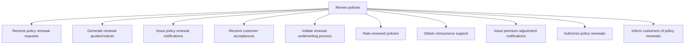

# Renew policies

> TODO: Business-as-Code definition for renew policies (property-and-casualty-insurance)

## Overview

TODO: Add process overview

## Process Hierarchy



## GraphDL

```yaml
renew:
  object: Policies
  actor: TODO
  result: TODO
```

## Actions

| Action | Description |
|--------|-------------|
| TODO | TODO |

## Events

| Event | Description |
|-------|-------------|
| TODO | TODO |

## Searches

| Search | Description |
|--------|-------------|
| TODO | TODO |

## Process Flow


## RACI Matrix

| Activity | Responsible | Accountable | Consulted | Informed |
|----------|-------------|-------------|-----------|----------|
| TODO | TODO | TODO | TODO | TODO |

## Sub-Processes

| ID | Name | Description |
|----|------|-------------|
| 4.3.1.6.1 | Receive policy renewal requests | TODO |
| 4.3.1.6.2 | Generate renewal quotes/notices | TODO |
| 4.3.1.6.3 | Issue policy renewal notifications | TODO |
| 4.3.1.6.4 | Receive customer acceptances | TODO |
| 4.3.1.6.5 | Initiate renewal underwriting process | TODO |
| 4.3.1.6.6 | Rate renewed policies | TODO |
| 4.3.1.6.7 | Obtain reinsurance support | TODO |
| 4.3.1.6.8 | Issue premium adjustment notifications | TODO |
| 4.3.1.6.9 | Authorize policy renewals | TODO |
| 4.3.1.6.10 | Inform customers of policy renewals | TODO |

## Related Processes

| Process | Relationship |
|---------|-------------|
| TODO | TODO |

## Related Departments

| Department | Role |
|-----------|------|
| TODO | TODO |

## Related Occupations

| Occupation | Involvement |
|-----------|-------------|
| TODO | TODO |

## KPIs

| KPI | Description | Unit |
|-----|-------------|------|
| TODO | TODO | TODO |

## Usage

```typescript
import { TODO } from '@headlessly/renew-policies'

const client = TODO()

// TODO: Example action calls
```
