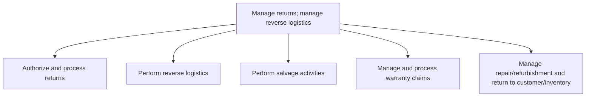

# Manage returns; manage reverse logistics

> TODO: Business-as-Code definition for manage returns; manage reverse logistics (education)

## Overview

TODO: Add process overview

## Process Hierarchy



## GraphDL

```yaml
manage:
  object: Returns; Manage Reverse Logistics
  actor: TODO
  result: TODO
```

## Actions

| Action | Description |
|--------|-------------|
| TODO | TODO |

## Events

| Event | Description |
|-------|-------------|
| TODO | TODO |

## Searches

| Search | Description |
|--------|-------------|
| TODO | TODO |

## Process Flow


## RACI Matrix

| Activity | Responsible | Accountable | Consulted | Informed |
|----------|-------------|-------------|-----------|----------|
| TODO | TODO | TODO | TODO | TODO |

## Sub-Processes

| ID | Name | Description |
|----|------|-------------|
| 4.3.5.1 | Authorize and process returns | TODO |
| 4.3.5.2 | Perform reverse logistics | TODO |
| 4.3.5.3 | Perform salvage activities | TODO |
| 4.3.5.4 | Manage and process warranty claims | TODO |
| 4.3.5.5 | Manage repair/refurbishment and return to customer/inventory | TODO |

## Related Processes

| Process | Relationship |
|---------|-------------|
| TODO | TODO |

## Related Departments

| Department | Role |
|-----------|------|
| TODO | TODO |

## Related Occupations

| Occupation | Involvement |
|-----------|-------------|
| TODO | TODO |

## KPIs

| KPI | Description | Unit |
|-----|-------------|------|
| TODO | TODO | TODO |

## Usage

```typescript
import { TODO } from '@headlessly/manage-returns;-manage-reverse-logistics'

const client = TODO()

// TODO: Example action calls
```
