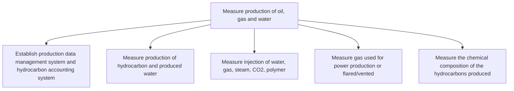

# Measure production of oil, gas and water

> TODO: Business-as-Code definition for measure production of oil, gas and water (petroleum-upstream)

## Overview

TODO: Add process overview

## Process Hierarchy



## GraphDL

```yaml
measure:
  object: Production Of Oil, Gas And Water
  actor: TODO
  result: TODO
```

## Actions

| Action | Description |
|--------|-------------|
| TODO | TODO |

## Events

| Event | Description |
|-------|-------------|
| TODO | TODO |

## Searches

| Search | Description |
|--------|-------------|
| TODO | TODO |

## Process Flow


## RACI Matrix

| Activity | Responsible | Accountable | Consulted | Informed |
|----------|-------------|-------------|-----------|----------|
| TODO | TODO | TODO | TODO | TODO |

## Sub-Processes

| ID | Name | Description |
|----|------|-------------|
| 4.5.3.1 | Establish production data management system and hydrocarbon accounting system | TODO |
| 4.5.3.2 | Measure production of hydrocarbon and produced water | TODO |
| 4.5.3.3 | Measure injection of water, gas, steam, CO2, polymer | TODO |
| 4.5.3.4 | Measure gas used for power production or flared/vented | TODO |
| 4.5.3.5 | Measure the chemical composition of the hydrocarbons produced | TODO |

## Related Processes

| Process | Relationship |
|---------|-------------|
| TODO | TODO |

## Related Departments

| Department | Role |
|-----------|------|
| TODO | TODO |

## Related Occupations

| Occupation | Involvement |
|-----------|-------------|
| TODO | TODO |

## KPIs

| KPI | Description | Unit |
|-----|-------------|------|
| TODO | TODO | TODO |

## Usage

```typescript
import { TODO } from '@headlessly/measure-production-of-oil,-gas-and-water'

const client = TODO()

// TODO: Example action calls
```
