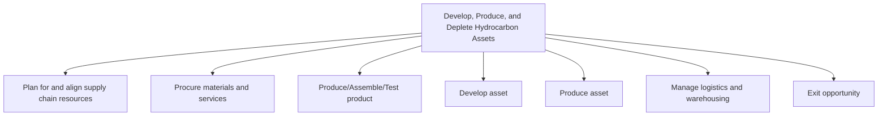

# Develop, Produce, and Deplete Hydrocarbon Assets

> TODO: Business-as-Code definition for develop, produce, and deplete hydrocarbon assets (petroleum-upstream)

## Overview

TODO: Add process overview

## Process Hierarchy



## GraphDL

```yaml
develop,:
  object: Produce, And Deplete Hydrocarbon Assets
  actor: TODO
  result: TODO
```

## Actions

| Action | Description |
|--------|-------------|
| TODO | TODO |

## Events

| Event | Description |
|-------|-------------|
| TODO | TODO |

## Searches

| Search | Description |
|--------|-------------|
| TODO | TODO |

## Process Flow


## RACI Matrix

| Activity | Responsible | Accountable | Consulted | Informed |
|----------|-------------|-------------|-----------|----------|
| TODO | TODO | TODO | TODO | TODO |

## Sub-Processes

| ID | Name | Description |
|----|------|-------------|
| 4.1 | Plan for and align supply chain resources | TODO |
| 4.2 | Procure materials and services | TODO |
| 4.3 | Produce/Assemble/Test product | TODO |
| 4.4 | Develop asset | TODO |
| 4.5 | Produce asset | TODO |
| 4.6 | Manage logistics and warehousing | TODO |
| 4.7 | Exit opportunity | TODO |

## Related Processes

| Process | Relationship |
|---------|-------------|
| TODO | TODO |

## Related Departments

| Department | Role |
|-----------|------|
| TODO | TODO |

## Related Occupations

| Occupation | Involvement |
|-----------|-------------|
| TODO | TODO |

## KPIs

| KPI | Description | Unit |
|-----|-------------|------|
| TODO | TODO | TODO |

## Usage

```typescript
import { TODO } from '@headlessly/develop,-produce,-and-deplete-hydrocarbon-assets'

const client = TODO()

// TODO: Example action calls
```
