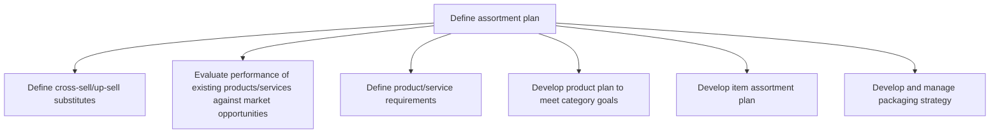

# Define assortment plan

> TODO: Business-as-Code definition for define assortment plan (retail)

## Overview

TODO: Add process overview

## Process Hierarchy



## GraphDL

```yaml
define:
  object: Assortment Plan
  actor: TODO
  result: TODO
```

## Actions

| Action | Description |
|--------|-------------|
| TODO | TODO |

## Events

| Event | Description |
|-------|-------------|
| TODO | TODO |

## Searches

| Search | Description |
|--------|-------------|
| TODO | TODO |

## Process Flow


## RACI Matrix

| Activity | Responsible | Accountable | Consulted | Informed |
|----------|-------------|-------------|-----------|----------|
| TODO | TODO | TODO | TODO | TODO |

## Sub-Processes

| ID | Name | Description |
|----|------|-------------|
| 4.1.2.1 | Define cross-sell/up-sell substitutes | TODO |
| 4.1.2.2 | Evaluate performance of existing products/services against market opportunities | TODO |
| 4.1.2.3 | Define product/service requirements | TODO |
| 4.1.2.4 | Develop product plan to meet category goals | TODO |
| 4.1.2.5 | Develop item assortment plan | TODO |
| 4.1.2.6 | Develop and manage packaging strategy | TODO |

## Related Processes

| Process | Relationship |
|---------|-------------|
| TODO | TODO |

## Related Departments

| Department | Role |
|-----------|------|
| TODO | TODO |

## Related Occupations

| Occupation | Involvement |
|-----------|-------------|
| TODO | TODO |

## KPIs

| KPI | Description | Unit |
|-----|-------------|------|
| TODO | TODO | TODO |

## Usage

```typescript
import { TODO } from '@headlessly/define-assortment-plan'

const client = TODO()

// TODO: Example action calls
```
