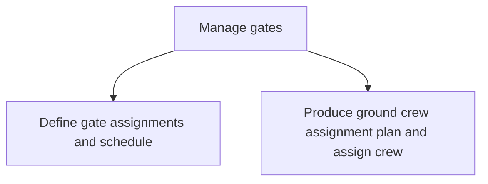

# Manage gates

> TODO: Business-as-Code definition for manage gates (airline)

## Overview

Managing crew based on gate needs. Review the flight schedule and aircraft types and determine a schedule based upon an understanding of constraints. Define ground crew assignment plan and assign crew based upon the available gates.  Determine the management of gates (by zone or by gate), the available gates, and review the crew schedule.

## Process Hierarchy



## GraphDL

```yaml
manage:
  object: Gates
  actor: TODO
  result: TODO
```

## Actions

| Action | Description |
|--------|-------------|
| TODO | TODO |

## Events

| Event | Description |
|-------|-------------|
| TODO | TODO |

## Searches

| Search | Description |
|--------|-------------|
| TODO | TODO |

## Process Flow


## RACI Matrix

| Activity | Responsible | Accountable | Consulted | Informed |
|----------|-------------|-------------|-----------|----------|
| TODO | TODO | TODO | TODO | TODO |

## Sub-Processes

| ID | Name | Description |
|----|------|-------------|
| 5.1.2.1 | Define gate assignments and schedule | TODO |
| 5.1.2.2 | Produce ground crew assignment plan and assign crew | This will be done based upon the available gates |

## Related Processes

| Process | Relationship |
|---------|-------------|
| TODO | TODO |

## Related Departments

| Department | Role |
|-----------|------|
| TODO | TODO |

## Related Occupations

| Occupation | Involvement |
|-----------|-------------|
| TODO | TODO |

## KPIs

| KPI | Description | Unit |
|-----|-------------|------|
| TODO | TODO | TODO |

## Usage

```typescript
import { TODO } from '@headlessly/manage-gates'

const client = TODO()

// TODO: Example action calls
```
