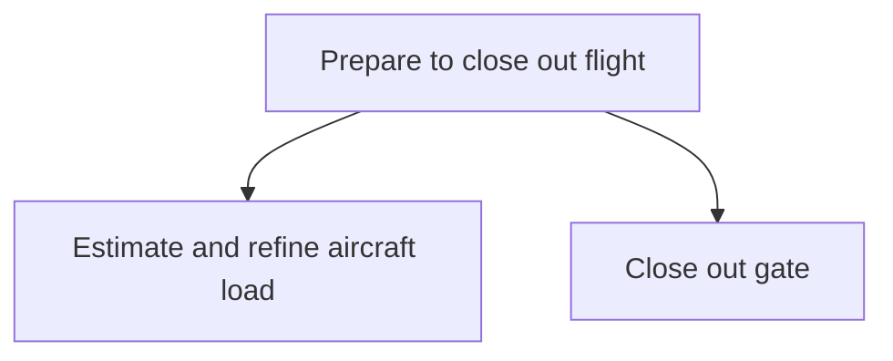

# Prepare to close out flight

> TODO: Business-as-Code definition for prepare to close out flight (airline)

## Overview

Estimating and refining the aircraft load.  This is done by estimating the total passenger/bags/cargo/fuel payload (zero fuel) and based on this, determining the fuel requirements. Thereafter, a load plan that ensures loading to achieve weight balance for minimum drag is created and signed-off, dangerous goods managed, a final balance trim at the aircraft side performed to confirm that weight balance is completed and the plane is ready to fly and the final load is communicated to the pilot.  (Trimming balances aerodynamic forces for zero rotation about the center of gravity).  The final activity in this process is the closing out of the flight.

## Process Hierarchy



## GraphDL

```yaml
prepare:
  object: To Close Out Flight
  actor: TODO
  result: TODO
```

## Actions

| Action | Description |
|--------|-------------|
| TODO | TODO |

## Events

| Event | Description |
|-------|-------------|
| TODO | TODO |

## Searches

| Search | Description |
|--------|-------------|
| TODO | TODO |

## Process Flow


## RACI Matrix

| Activity | Responsible | Accountable | Consulted | Informed |
|----------|-------------|-------------|-----------|----------|
| TODO | TODO | TODO | TODO | TODO |

## Sub-Processes

| ID | Name | Description |
|----|------|-------------|
| 5.1.3.1 | Estimate and refine aircraft load | TODO |
| 5.1.3.2 | Close out gate | TODO |

## Related Processes

| Process | Relationship |
|---------|-------------|
| TODO | TODO |

## Related Departments

| Department | Role |
|-----------|------|
| TODO | TODO |

## Related Occupations

| Occupation | Involvement |
|-----------|-------------|
| TODO | TODO |

## KPIs

| KPI | Description | Unit |
|-----|-------------|------|
| TODO | TODO | TODO |

## Usage

```typescript
import { TODO } from '@headlessly/prepare-to-close-out-flight'

const client = TODO()

// TODO: Example action calls
```
