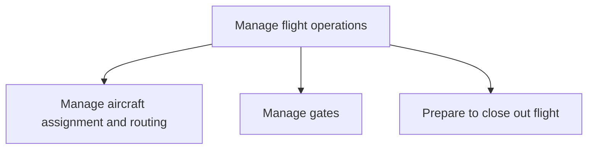

# Manage flight operations

> TODO: Business-as-Code definition for manage flight operations (airline)

## Overview

Managing all aspects of flight operations. Flight operations encompass the assignment and routing of the aircraft, the management of  gates, and the closing out of the flight.

## Process Hierarchy



## GraphDL

```yaml
manage:
  object: Flight Operations
  actor: TODO
  result: TODO
```

## Actions

| Action | Description |
|--------|-------------|
| TODO | TODO |

## Events

| Event | Description |
|-------|-------------|
| TODO | TODO |

## Searches

| Search | Description |
|--------|-------------|
| TODO | TODO |

## Process Flow


## RACI Matrix

| Activity | Responsible | Accountable | Consulted | Informed |
|----------|-------------|-------------|-----------|----------|
| TODO | TODO | TODO | TODO | TODO |

## Sub-Processes

| ID | Name | Description |
|----|------|-------------|
| 5.1.1 | Manage aircraft assignment and routing | Overseeing all aspects of assigning and routing aircraft. This entails assigning aircraft tail numbe |
| 5.1.2 | Manage gates | Managing crew based on gate needs. Review the flight schedule and aircraft types and determine a sch |
| 5.1.3 | Prepare to close out flight | Estimating and refining the aircraft load.  This is done by estimating the total passenger/bags/carg |

## Related Processes

| Process | Relationship |
|---------|-------------|
| TODO | TODO |

## Related Departments

| Department | Role |
|-----------|------|
| TODO | TODO |

## Related Occupations

| Occupation | Involvement |
|-----------|-------------|
| TODO | TODO |

## KPIs

| KPI | Description | Unit |
|-----|-------------|------|
| TODO | TODO | TODO |

## Usage

```typescript
import { TODO } from '@headlessly/manage-flight-operations'

const client = TODO()

// TODO: Example action calls
```
