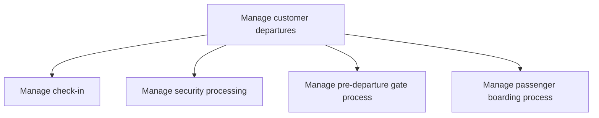

# Manage customer departures

> TODO: Business-as-Code definition for manage customer departures (airline)

## Overview

Steering the passenger experience from check-in to boarding. Managing customer departures includes: managing check-in; security processing, which includes verifying passenger identity; the pre-departure gate process, which includes providing premium lounge access; managing overbooked flights; managing customer special needs, etc.; and the passenger boarding process.

## Process Hierarchy



## GraphDL

```yaml
manage:
  object: Customer Departures
  actor: TODO
  result: TODO
```

## Actions

| Action | Description |
|--------|-------------|
| TODO | TODO |

## Events

| Event | Description |
|-------|-------------|
| TODO | TODO |

## Searches

| Search | Description |
|--------|-------------|
| TODO | TODO |

## Process Flow


## RACI Matrix

| Activity | Responsible | Accountable | Consulted | Informed |
|----------|-------------|-------------|-----------|----------|
| TODO | TODO | TODO | TODO | TODO |

## Sub-Processes

| ID | Name | Description |
|----|------|-------------|
| 5.2.1.1 | Manage check-in | TODO |
| 5.2.1.2 | Manage security processing | This include verifying passenger identity |
| 5.2.1.3 | Manage pre-departure gate process | This includes providing premium lounge access, managing overbooked flights, managing customer specia |
| 5.2.1.4 | Manage passenger boarding process | TODO |

## Related Processes

| Process | Relationship |
|---------|-------------|
| TODO | TODO |

## Related Departments

| Department | Role |
|-----------|------|
| TODO | TODO |

## Related Occupations

| Occupation | Involvement |
|-----------|-------------|
| TODO | TODO |

## KPIs

| KPI | Description | Unit |
|-----|-------------|------|
| TODO | TODO | TODO |

## Usage

```typescript
import { TODO } from '@headlessly/manage-customer-departures'

const client = TODO()

// TODO: Example action calls
```
