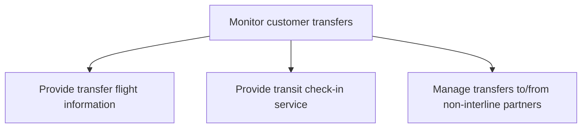

# Monitor customer transfers

> TODO: Business-as-Code definition for monitor customer transfers (airline)

## Overview

Overseeing passenger flight transfers.  Manage transfer flight information which includes managing date/flight information display systems, a transit check-in service, and the management of transfers to / from non-interline partners, including check-in of interline passengers and baggage.

## Process Hierarchy



## GraphDL

```yaml
monitor:
  object: Customer Transfers
  actor: TODO
  result: TODO
```

## Actions

| Action | Description |
|--------|-------------|
| TODO | TODO |

## Events

| Event | Description |
|-------|-------------|
| TODO | TODO |

## Searches

| Search | Description |
|--------|-------------|
| TODO | TODO |

## Process Flow


## RACI Matrix

| Activity | Responsible | Accountable | Consulted | Informed |
|----------|-------------|-------------|-----------|----------|
| TODO | TODO | TODO | TODO | TODO |

## Sub-Processes

| ID | Name | Description |
|----|------|-------------|
| 5.2.2.1 | Provide transfer flight information | This includes managing date/flight information display systems |
| 5.2.2.2 | Provide transit check-in service | TODO |
| 5.2.2.3 | Manage transfers to/from non-interline partners | This includes check-in of interline passengers and baggage |

## Related Processes

| Process | Relationship |
|---------|-------------|
| TODO | TODO |

## Related Departments

| Department | Role |
|-----------|------|
| TODO | TODO |

## Related Occupations

| Occupation | Involvement |
|-----------|-------------|
| TODO | TODO |

## KPIs

| KPI | Description | Unit |
|-----|-------------|------|
| TODO | TODO | TODO |

## Usage

```typescript
import { TODO } from '@headlessly/monitor-customer-transfers'

const client = TODO()

// TODO: Example action calls
```
