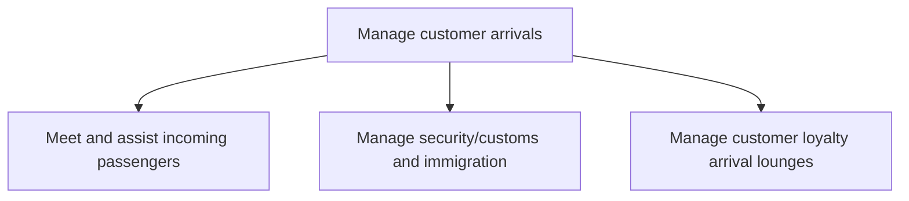

# Manage customer arrivals

> TODO: Business-as-Code definition for manage customer arrivals (airline)

## Overview

Handling passenger information and experience upon arrival.  Meet and assist incoming passengers, including: provision of information and special services, managing security/customs and immigration, and customer loyalty arrival lounges.  Managing lounges includes the provision of amenities, connectivity, and conference services.

## Process Hierarchy



## GraphDL

```yaml
manage:
  object: Customer Arrivals
  actor: TODO
  result: TODO
```

## Actions

| Action | Description |
|--------|-------------|
| TODO | TODO |

## Events

| Event | Description |
|-------|-------------|
| TODO | TODO |

## Searches

| Search | Description |
|--------|-------------|
| TODO | TODO |

## Process Flow


## RACI Matrix

| Activity | Responsible | Accountable | Consulted | Informed |
|----------|-------------|-------------|-----------|----------|
| TODO | TODO | TODO | TODO | TODO |

## Sub-Processes

| ID | Name | Description |
|----|------|-------------|
| 5.2.3.1 | Meet and assist incoming passengers | This includes provision of information and special services |
| 5.2.3.2 | Manage security/customs and immigration | TODO |
| 5.2.3.3 | Manage customer loyalty arrival lounges | This includes provision of amenities, connectivity and conference services |

## Related Processes

| Process | Relationship |
|---------|-------------|
| TODO | TODO |

## Related Departments

| Department | Role |
|-----------|------|
| TODO | TODO |

## Related Occupations

| Occupation | Involvement |
|-----------|-------------|
| TODO | TODO |

## KPIs

| KPI | Description | Unit |
|-----|-------------|------|
| TODO | TODO | TODO |

## Usage

```typescript
import { TODO } from '@headlessly/manage-customer-arrivals'

const client = TODO()

// TODO: Example action calls
```
