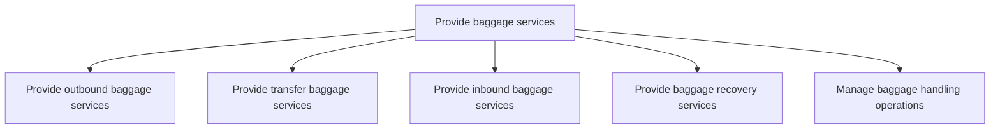

# Provide baggage services

> TODO: Business-as-Code definition for provide baggage services (airline)

## Overview

Provisioning all aspects of baggage handling for passengers. The airline provides outbound baggage services (receiving baggage, conducting baggage security checks, sorting and transporting baggage to the aircraft); transfer baggage services and inbound baggage services(unloading baggage and transferring to baggage claim); baggage recovery services and the management of baggage handling operations, which covers the completion and transport of freight and documentation.

## Process Hierarchy



## GraphDL

```yaml
provide:
  object: Baggage Services
  actor: TODO
  result: TODO
```

## Actions

| Action | Description |
|--------|-------------|
| TODO | TODO |

## Events

| Event | Description |
|-------|-------------|
| TODO | TODO |

## Searches

| Search | Description |
|--------|-------------|
| TODO | TODO |

## Process Flow


## RACI Matrix

| Activity | Responsible | Accountable | Consulted | Informed |
|----------|-------------|-------------|-----------|----------|
| TODO | TODO | TODO | TODO | TODO |

## Sub-Processes

| ID | Name | Description |
|----|------|-------------|
| 5.2.4.1 | Provide outbound baggage services | This includes receiving baggage, conducting baggage checks, sorting and transporting baggage to airc |
| 5.2.4.2 | Provide transfer baggage services | TODO |
| 5.2.4.3 | Provide inbound baggage services | This includes unloading baggage and transferring to baggage claim |
| 5.2.4.4 | Provide baggage recovery services | TODO |
| 5.2.4.5 | Manage baggage handling operations | This covers the completion and transport of freight and documentation |

## Related Processes

| Process | Relationship |
|---------|-------------|
| TODO | TODO |

## Related Departments

| Department | Role |
|-----------|------|
| TODO | TODO |

## Related Occupations

| Occupation | Involvement |
|-----------|-------------|
| TODO | TODO |

## KPIs

| KPI | Description | Unit |
|-----|-------------|------|
| TODO | TODO | TODO |

## Usage

```typescript
import { TODO } from '@headlessly/provide-baggage-services'

const client = TODO()

// TODO: Example action calls
```
