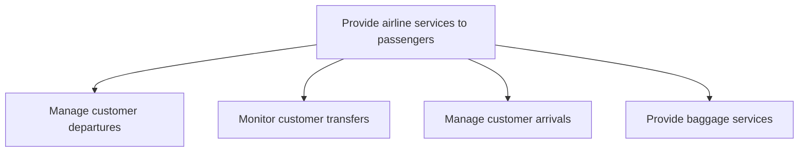

# Provide airline services to passengers

> TODO: Business-as-Code definition for provide airline services to passengers (airline)

## Overview

Managing the flow of passengers and baggage. This is an aggregation of passenger/customer and baggage movement.  It encompasses the management of customer departures and arrivals, the monitoring of customer transfers, the provision of baggage services, as well as a process to ensure the services are provided at a consistent, satisfactory level of quality.

## Process Hierarchy



## GraphDL

```yaml
provide:
  object: Airline Services To Passengers
  actor: TODO
  result: TODO
```

## Actions

| Action | Description |
|--------|-------------|
| TODO | TODO |

## Events

| Event | Description |
|-------|-------------|
| TODO | TODO |

## Searches

| Search | Description |
|--------|-------------|
| TODO | TODO |

## Process Flow


## RACI Matrix

| Activity | Responsible | Accountable | Consulted | Informed |
|----------|-------------|-------------|-----------|----------|
| TODO | TODO | TODO | TODO | TODO |

## Sub-Processes

| ID | Name | Description |
|----|------|-------------|
| 5.2.1 | Manage customer departures | Steering the passenger experience from check-in to boarding. Managing customer departures includes:  |
| 5.2.2 | Monitor customer transfers | Overseeing passenger flight transfers.  Manage transfer flight information which includes managing d |
| 5.2.3 | Manage customer arrivals | Handling passenger information and experience upon arrival.  Meet and assist incoming passengers, in |
| 5.2.4 | Provide baggage services | Provisioning all aspects of baggage handling for passengers. The airline provides outbound baggage s |

## Related Processes

| Process | Relationship |
|---------|-------------|
| TODO | TODO |

## Related Departments

| Department | Role |
|-----------|------|
| TODO | TODO |

## Related Occupations

| Occupation | Involvement |
|-----------|-------------|
| TODO | TODO |

## KPIs

| KPI | Description | Unit |
|-----|-------------|------|
| TODO | TODO | TODO |

## Usage

```typescript
import { TODO } from '@headlessly/provide-airline-services-to-passengers'

const client = TODO()

// TODO: Example action calls
```
