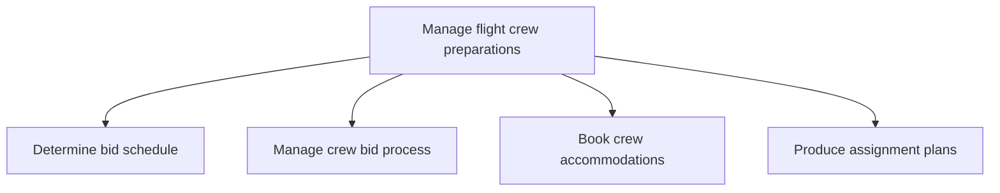

# Manage flight crew preparations

> TODO: Business-as-Code definition for manage flight crew preparations (airline)

## Overview

Scheduling crew for flight assignments. The crew provide bids for choosing their duty /off-duty period and these bids are factored in to create crew rosters.  Resource and reserve requirements are determined, and bid services / technology / other enablers are provided to submit bids. Thereafter, the crew bid process, which includes receiving bids for current and vacation schedules, is managed, crew accommodations booked and assignment plans produced.

## Process Hierarchy



## GraphDL

```yaml
manage:
  object: Flight Crew Preparations
  actor: TODO
  result: TODO
```

## Actions

| Action | Description |
|--------|-------------|
| TODO | TODO |

## Events

| Event | Description |
|-------|-------------|
| TODO | TODO |

## Searches

| Search | Description |
|--------|-------------|
| TODO | TODO |

## Process Flow


## RACI Matrix

| Activity | Responsible | Accountable | Consulted | Informed |
|----------|-------------|-------------|-----------|----------|
| TODO | TODO | TODO | TODO | TODO |

## Sub-Processes

| ID | Name | Description |
|----|------|-------------|
| 5.3.1.1 | Determine bid schedule | Crew provide bids for choosing their duty /off-duty period. Bids are factored in to create crew rost |
| 5.3.1.2 | Manage crew bid process | This includes receiving bids for current and vacation schedules |
| 5.3.1.3 | Book crew accommodations | TODO |
| 5.3.1.4 | Produce assignment plans | TODO |

## Related Processes

| Process | Relationship |
|---------|-------------|
| TODO | TODO |

## Related Departments

| Department | Role |
|-----------|------|
| TODO | TODO |

## Related Occupations

| Occupation | Involvement |
|-----------|-------------|
| TODO | TODO |

## KPIs

| KPI | Description | Unit |
|-----|-------------|------|
| TODO | TODO | TODO |

## Usage

```typescript
import { TODO } from '@headlessly/manage-flight-crew-preparations'

const client = TODO()

// TODO: Example action calls
```
