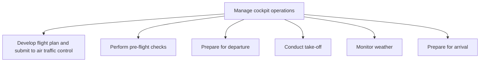

# Manage cockpit operations

> TODO: Business-as-Code definition for manage cockpit operations (airline)

## Overview

Managing cockpit activities and coordinating operations between cockpit and air traffic control.  Develop a flight plan and submit to air traffic control (ATC). Perform pre-flight checks and prepare for departure, as well as the actual take-off.  While in flight, the weather is monitored on a continuous basis.  Prepare for arrival at the destination.

## Process Hierarchy



## GraphDL

```yaml
manage:
  object: Cockpit Operations
  actor: TODO
  result: TODO
```

## Actions

| Action | Description |
|--------|-------------|
| TODO | TODO |

## Events

| Event | Description |
|-------|-------------|
| TODO | TODO |

## Searches

| Search | Description |
|--------|-------------|
| TODO | TODO |

## Process Flow


## RACI Matrix

| Activity | Responsible | Accountable | Consulted | Informed |
|----------|-------------|-------------|-----------|----------|
| TODO | TODO | TODO | TODO | TODO |

## Sub-Processes

| ID | Name | Description |
|----|------|-------------|
| 5.3.2.1 | Develop flight plan and submit to air traffic control | TODO |
| 5.3.2.2 | Perform pre-flight checks | TODO |
| 5.3.2.3 | Prepare for departure | TODO |
| 5.3.2.4 | Conduct take-off | TODO |
| 5.3.2.5 | Monitor weather | TODO |
| 5.3.2.6 | Prepare for arrival | TODO |

## Related Processes

| Process | Relationship |
|---------|-------------|
| TODO | TODO |

## Related Departments

| Department | Role |
|-----------|------|
| TODO | TODO |

## Related Occupations

| Occupation | Involvement |
|-----------|-------------|
| TODO | TODO |

## KPIs

| KPI | Description | Unit |
|-----|-------------|------|
| TODO | TODO | TODO |

## Usage

```typescript
import { TODO } from '@headlessly/manage-cockpit-operations'

const client = TODO()

// TODO: Example action calls
```
