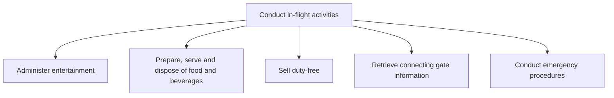

# Conduct in-flight activities

> TODO: Business-as-Code definition for conduct in-flight activities (airline)

## Overview

TODO: Add process overview

## Process Hierarchy



## GraphDL

```yaml
conduct:
  object: In-flight Activities
  actor: TODO
  result: TODO
```

## Actions

| Action | Description |
|--------|-------------|
| TODO | TODO |

## Events

| Event | Description |
|-------|-------------|
| TODO | TODO |

## Searches

| Search | Description |
|--------|-------------|
| TODO | TODO |

## Process Flow


## RACI Matrix

| Activity | Responsible | Accountable | Consulted | Informed |
|----------|-------------|-------------|-----------|----------|
| TODO | TODO | TODO | TODO | TODO |

## Sub-Processes

| ID | Name | Description |
|----|------|-------------|
| 5.3.4.2.1 | Administer entertainment | TODO |
| 5.3.4.2.2 | Prepare, serve and dispose of food and beverages | TODO |
| 5.3.4.2.3 | Sell duty-free | TODO |
| 5.3.4.2.4 | Retrieve connecting gate information | TODO |
| 5.3.4.2.5 | Conduct emergency procedures | TODO |

## Related Processes

| Process | Relationship |
|---------|-------------|
| TODO | TODO |

## Related Departments

| Department | Role |
|-----------|------|
| TODO | TODO |

## Related Occupations

| Occupation | Involvement |
|-----------|-------------|
| TODO | TODO |

## KPIs

| KPI | Description | Unit |
|-----|-------------|------|
| TODO | TODO | TODO |

## Usage

```typescript
import { TODO } from '@headlessly/conduct-in-flight-activities'

const client = TODO()

// TODO: Example action calls
```
