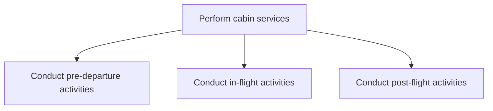

# Perform cabin services

> TODO: Business-as-Code definition for perform cabin services (airline)

## Overview

Carrying out cabin activities to service passengers. Servicing passengers on a plane encompasses the following: execution of pre-departure activities, including assisting passengers with boarding, verifying passenger identities, conducting pre-flight briefings of the crew, managing onboard catering, performing safety briefings, and completing cabin checks; conducting in-flight activities such as administering entertainment, preparing, serving and disposing of food and beverages, sell duty-free goods, retrieving connecting gate information, and conducting emergency procedures;  post flight activities such as assisting passengers de-planning, completing post-flight reports, providing post-crew reports, and monitor crew performance.

## Process Hierarchy



## GraphDL

```yaml
perform:
  object: Cabin Services
  actor: TODO
  result: TODO
```

## Actions

| Action | Description |
|--------|-------------|
| TODO | TODO |

## Events

| Event | Description |
|-------|-------------|
| TODO | TODO |

## Searches

| Search | Description |
|--------|-------------|
| TODO | TODO |

## Process Flow


## RACI Matrix

| Activity | Responsible | Accountable | Consulted | Informed |
|----------|-------------|-------------|-----------|----------|
| TODO | TODO | TODO | TODO | TODO |

## Sub-Processes

| ID | Name | Description |
|----|------|-------------|
| 5.3.4.1 | Conduct pre-departure activities | TODO |
| 5.3.4.2 | Conduct in-flight activities | TODO |
| 5.3.4.3 | Conduct post-flight activities | TODO |

## Related Processes

| Process | Relationship |
|---------|-------------|
| TODO | TODO |

## Related Departments

| Department | Role |
|-----------|------|
| TODO | TODO |

## Related Occupations

| Occupation | Involvement |
|-----------|-------------|
| TODO | TODO |

## KPIs

| KPI | Description | Unit |
|-----|-------------|------|
| TODO | TODO | TODO |

## Usage

```typescript
import { TODO } from '@headlessly/perform-cabin-services'

const client = TODO()

// TODO: Example action calls
```
