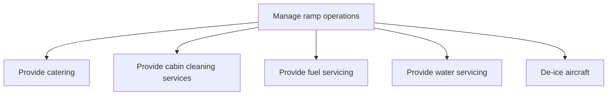

# Manage ramp operations

> TODO: Business-as-Code definition for manage ramp operations (airline)

## Overview

Provisioning of catering, cabin-cleaning services, fuel servicing, water servicing and the de-icing of aircraft.

## Process Hierarchy



## GraphDL

```yaml
manage:
  object: Ramp Operations
  actor: TODO
  result: TODO
```

## Actions

| Action | Description |
|--------|-------------|
| TODO | TODO |

## Events

| Event | Description |
|-------|-------------|
| TODO | TODO |

## Searches

| Search | Description |
|--------|-------------|
| TODO | TODO |

## Process Flow


## RACI Matrix

| Activity | Responsible | Accountable | Consulted | Informed |
|----------|-------------|-------------|-----------|----------|
| TODO | TODO | TODO | TODO | TODO |

## Sub-Processes

| ID | Name | Description |
|----|------|-------------|
| 5.3.5.1 | Provide catering | TODO |
| 5.3.5.2 | Provide cabin cleaning services | TODO |
| 5.3.5.3 | Provide fuel servicing | TODO |
| 5.3.5.4 | Provide water servicing | TODO |
| 5.3.5.5 | De-ice aircraft | TODO |

## Related Processes

| Process | Relationship |
|---------|-------------|
| TODO | TODO |

## Related Departments

| Department | Role |
|-----------|------|
| TODO | TODO |

## Related Occupations

| Occupation | Involvement |
|-----------|-------------|
| TODO | TODO |

## KPIs

| KPI | Description | Unit |
|-----|-------------|------|
| TODO | TODO | TODO |

## Usage

```typescript
import { TODO } from '@headlessly/manage-ramp-operations'

const client = TODO()

// TODO: Example action calls
```
