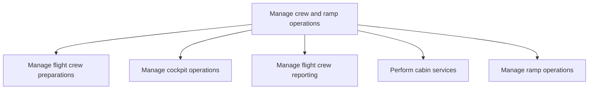

# Manage crew and ramp operations

> TODO: Business-as-Code definition for manage crew and ramp operations (airline)

## Overview

Managing flight crew preparations, cockpit operations, flight crew reporting and ramp operations.  Also included in this group is the delivery of cabin services to passengers.

## Process Hierarchy



## GraphDL

```yaml
manage:
  object: Crew And Ramp Operations
  actor: TODO
  result: TODO
```

## Actions

| Action | Description |
|--------|-------------|
| TODO | TODO |

## Events

| Event | Description |
|-------|-------------|
| TODO | TODO |

## Searches

| Search | Description |
|--------|-------------|
| TODO | TODO |

## Process Flow


## RACI Matrix

| Activity | Responsible | Accountable | Consulted | Informed |
|----------|-------------|-------------|-----------|----------|
| TODO | TODO | TODO | TODO | TODO |

## Sub-Processes

| ID | Name | Description |
|----|------|-------------|
| 5.3.1 | Manage flight crew preparations | Scheduling crew for flight assignments. The crew provide bids for choosing their duty /off-duty peri |
| 5.3.2 | Manage cockpit operations | Managing cockpit activities and coordinating operations between cockpit and air traffic control.  De |
| 5.3.3 | Manage flight crew reporting | Preparing in-flight incident and maintenance reports. |
| 5.3.4 | Perform cabin services | Carrying out cabin activities to service passengers. Servicing passengers on a plane encompasses the |
| 5.3.5 | Manage ramp operations | Provisioning of catering, cabin-cleaning services, fuel servicing, water servicing and the de-icing  |

## Related Processes

| Process | Relationship |
|---------|-------------|
| TODO | TODO |

## Related Departments

| Department | Role |
|-----------|------|
| TODO | TODO |

## Related Occupations

| Occupation | Involvement |
|-----------|-------------|
| TODO | TODO |

## KPIs

| KPI | Description | Unit |
|-----|-------------|------|
| TODO | TODO | TODO |

## Usage

```typescript
import { TODO } from '@headlessly/manage-crew-and-ramp-operations'

const client = TODO()

// TODO: Example action calls
```
