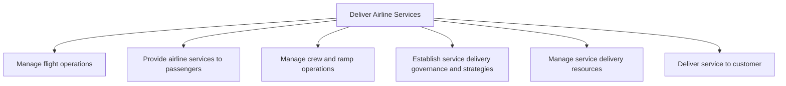

# Deliver Airline Services

> TODO: Business-as-Code definition for deliver airline services (airline)

## Overview

TODO: Add process overview

## Process Hierarchy



## GraphDL

```yaml
deliver:
  object: Airline Services
  actor: TODO
  result: TODO
```

## Actions

| Action | Description |
|--------|-------------|
| TODO | TODO |

## Events

| Event | Description |
|-------|-------------|
| TODO | TODO |

## Searches

| Search | Description |
|--------|-------------|
| TODO | TODO |

## Process Flow


## RACI Matrix

| Activity | Responsible | Accountable | Consulted | Informed |
|----------|-------------|-------------|-----------|----------|
| TODO | TODO | TODO | TODO | TODO |

## Sub-Processes

| ID | Name | Description |
|----|------|-------------|
| 5.1 | Manage flight operations | Managing all aspects of flight operations. Flight operations encompass the assignment and routing of |
| 5.2 | Provide airline services to passengers | Managing the flow of passengers and baggage. This is an aggregation of passenger/customer and baggag |
| 5.3 | Manage crew and ramp operations | Managing flight crew preparations, cockpit operations, flight crew reporting and ramp operations.  A |
| 5.4 | Establish service delivery governance and strategies | Creating rules and regulations for service delivery to the customer. Establish a system to manage pe |
| 5.5 | Manage service delivery resources | Understanding the demands on resources and creating a plan to enable the delivery of services via th |
| 5.6 | Deliver service to customer | Rendering service to the customer by initiating, executing, and completing tasks associated with ser |

## Related Processes

| Process | Relationship |
|---------|-------------|
| TODO | TODO |

## Related Departments

| Department | Role |
|-----------|------|
| TODO | TODO |

## Related Occupations

| Occupation | Involvement |
|-----------|-------------|
| TODO | TODO |

## KPIs

| KPI | Description | Unit |
|-----|-------------|------|
| TODO | TODO | TODO |

## Usage

```typescript
import { TODO } from '@headlessly/deliver-airline-services'

const client = TODO()

// TODO: Example action calls
```
