# Manage inventory

> TODO: Business-as-Code definition for manage inventory (retail)

## Overview

TODO: Add process overview

## Process Hierarchy

```mermaid
graph TD
    A[Manage inventory]
    A --> B[Plan inventory and replenishment levels]
    A --> C[Track quantity and location of items]
    A --> D[Determine lot numbering system]
    A --> E[Determine lot usage]
    A --> F[Track and manage lots and serial numbered items]
    A --> G[Track inventory deployment]
    A --> H[Receive, inspect, and store inbound deliveries]
    A --> I[Track product availability]
    A --> J[Track inventory accuracy]
    A --> K[Track third-party logistics storage and shipping performance]
    A --> L[Manage physical finished goods inventory]
    A --> M[Prepare items/products for sale]
    A --> N[Repackage items into SKUs]
```



## GraphDL

```yaml
manage:
  object: Inventory
  actor: TODO
  result: TODO
```

## Actions

| Action | Description |
|--------|-------------|
| TODO | TODO |

## Events

| Event | Description |
|-------|-------------|
| TODO | TODO |

## Searches

| Search | Description |
|--------|-------------|
| TODO | TODO |

## Process Flow


## RACI Matrix

| Activity | Responsible | Accountable | Consulted | Informed |
|----------|-------------|-------------|-----------|----------|
| TODO | TODO | TODO | TODO | TODO |

## Sub-Processes

| ID | Name | Description |
|----|------|-------------|
| 5.1.2.1 | Plan inventory and replenishment levels | TODO |
| 5.1.2.2 | Track quantity and location of items | TODO |
| 5.1.2.3 | Determine lot numbering system | TODO |
| 5.1.2.4 | Determine lot usage | TODO |
| 5.1.2.5 | Track and manage lots and serial numbered items | TODO |
| 5.1.2.6 | Track inventory deployment | TODO |
| 5.1.2.7 | Receive, inspect, and store inbound deliveries | TODO |
| 5.1.2.8 | Track product availability | TODO |
| 5.1.2.9 | Track inventory accuracy | TODO |
| 5.1.2.10 | Track third-party logistics storage and shipping performance | TODO |
| 5.1.2.11 | Manage physical finished goods inventory | TODO |
| 5.1.2.12 | Prepare items/products for sale | TODO |
| 5.1.2.13 | Repackage items into SKUs | TODO |

## Related Processes

| Process | Relationship |
|---------|-------------|
| TODO | TODO |

## Related Departments

| Department | Role |
|-----------|------|
| TODO | TODO |

## Related Occupations

| Occupation | Involvement |
|-----------|-------------|
| TODO | TODO |

## KPIs

| KPI | Description | Unit |
|-----|-------------|------|
| TODO | TODO | TODO |

## Usage

```typescript
import { TODO } from '@headlessly/manage-inventory'

const client = TODO()

// TODO: Example action calls
```
