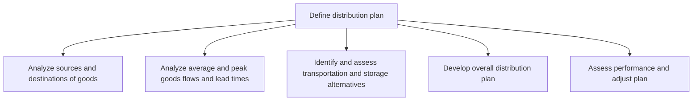

# Define distribution plan

> TODO: Business-as-Code definition for define distribution plan (retail)

## Overview

TODO: Add process overview

## Process Hierarchy



## GraphDL

```yaml
define:
  object: Distribution Plan
  actor: TODO
  result: TODO
```

## Actions

| Action | Description |
|--------|-------------|
| TODO | TODO |

## Events

| Event | Description |
|-------|-------------|
| TODO | TODO |

## Searches

| Search | Description |
|--------|-------------|
| TODO | TODO |

## Process Flow


## RACI Matrix

| Activity | Responsible | Accountable | Consulted | Informed |
|----------|-------------|-------------|-----------|----------|
| TODO | TODO | TODO | TODO | TODO |

## Sub-Processes

| ID | Name | Description |
|----|------|-------------|
| 5.2.1.1 | Analyze sources and destinations of goods | TODO |
| 5.2.1.2 | Analyze average and peak goods flows and lead times | TODO |
| 5.2.1.3 | Identify and assess transportation and storage alternatives | TODO |
| 5.2.1.4 | Develop overall distribution plan | TODO |
| 5.2.1.5 | Assess performance and adjust plan | TODO |

## Related Processes

| Process | Relationship |
|---------|-------------|
| TODO | TODO |

## Related Departments

| Department | Role |
|-----------|------|
| TODO | TODO |

## Related Occupations

| Occupation | Involvement |
|-----------|-------------|
| TODO | TODO |

## KPIs

| KPI | Description | Unit |
|-----|-------------|------|
| TODO | TODO | TODO |

## Usage

```typescript
import { TODO } from '@headlessly/define-distribution-plan'

const client = TODO()

// TODO: Example action calls
```
