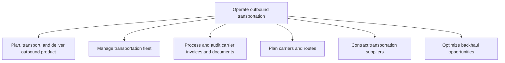

# Operate outbound transportation

> TODO: Business-as-Code definition for operate outbound transportation (retail)

## Overview

TODO: Add process overview

## Process Hierarchy



## GraphDL

```yaml
operate:
  object: Outbound Transportation
  actor: TODO
  result: TODO
```

## Actions

| Action | Description |
|--------|-------------|
| TODO | TODO |

## Events

| Event | Description |
|-------|-------------|
| TODO | TODO |

## Searches

| Search | Description |
|--------|-------------|
| TODO | TODO |

## Process Flow


## RACI Matrix

| Activity | Responsible | Accountable | Consulted | Informed |
|----------|-------------|-------------|-----------|----------|
| TODO | TODO | TODO | TODO | TODO |

## Sub-Processes

| ID | Name | Description |
|----|------|-------------|
| 5.2.5.1 | Plan, transport, and deliver outbound product | TODO |
| 5.2.5.2 | Manage transportation fleet | TODO |
| 5.2.5.3 | Process and audit carrier invoices and documents | TODO |
| 5.2.5.4 | Plan carriers and routes | TODO |
| 5.2.5.5 | Contract transportation suppliers | TODO |
| 5.2.5.6 | Optimize backhaul opportunities | TODO |

## Related Processes

| Process | Relationship |
|---------|-------------|
| TODO | TODO |

## Related Departments

| Department | Role |
|-----------|------|
| TODO | TODO |

## Related Occupations

| Occupation | Involvement |
|-----------|-------------|
| TODO | TODO |

## KPIs

| KPI | Description | Unit |
|-----|-------------|------|
| TODO | TODO | TODO |

## Usage

```typescript
import { TODO } from '@headlessly/operate-outbound-transportation'

const client = TODO()

// TODO: Example action calls
```
