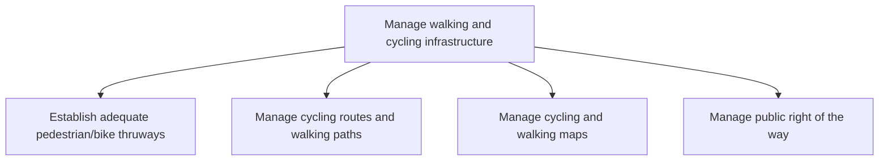

# Manage walking and cycling infrastructure

> TODO: Business-as-Code definition for manage walking and cycling infrastructure (city-government)

## Overview

TODO: Add process overview

## Process Hierarchy



## GraphDL

```yaml
manage:
  object: Walking And Cycling Infrastructure
  actor: TODO
  result: TODO
```

## Actions

| Action | Description |
|--------|-------------|
| TODO | TODO |

## Events

| Event | Description |
|-------|-------------|
| TODO | TODO |

## Searches

| Search | Description |
|--------|-------------|
| TODO | TODO |

## Process Flow


## RACI Matrix

| Activity | Responsible | Accountable | Consulted | Informed |
|----------|-------------|-------------|-----------|----------|
| TODO | TODO | TODO | TODO | TODO |

## Sub-Processes

| ID | Name | Description |
|----|------|-------------|
| 5.11.6.1 | Establish adequate pedestrian/bike thruways | TODO |
| 5.11.6.2 | Manage cycling routes and walking paths | TODO |
| 5.11.6.3 | Manage cycling and walking maps | TODO |
| 5.11.6.4 | Manage public right of the way | TODO |

## Related Processes

| Process | Relationship |
|---------|-------------|
| TODO | TODO |

## Related Departments

| Department | Role |
|-----------|------|
| TODO | TODO |

## Related Occupations

| Occupation | Involvement |
|-----------|-------------|
| TODO | TODO |

## KPIs

| KPI | Description | Unit |
|-----|-------------|------|
| TODO | TODO | TODO |

## Usage

```typescript
import { TODO } from '@headlessly/manage-walking-and-cycling-infrastructure'

const client = TODO()

// TODO: Example action calls
```
