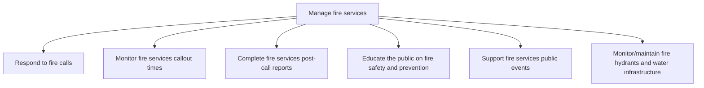

# Manage fire services

> TODO: Business-as-Code definition for manage fire services (city-government)

## Overview

TODO: Add process overview

## Process Hierarchy



## GraphDL

```yaml
manage:
  object: Fire Services
  actor: TODO
  result: TODO
```

## Actions

| Action | Description |
|--------|-------------|
| TODO | TODO |

## Events

| Event | Description |
|-------|-------------|
| TODO | TODO |

## Searches

| Search | Description |
|--------|-------------|
| TODO | TODO |

## Process Flow


## RACI Matrix

| Activity | Responsible | Accountable | Consulted | Informed |
|----------|-------------|-------------|-----------|----------|
| TODO | TODO | TODO | TODO | TODO |

## Sub-Processes

| ID | Name | Description |
|----|------|-------------|
| 5.9.3.1 | Respond to fire calls | TODO |
| 5.9.3.2 | Monitor fire services callout times | TODO |
| 5.9.3.3 | Complete fire services post-call reports | TODO |
| 5.9.3.4 | Educate the public on fire safety and prevention | TODO |
| 5.9.3.5 | Support fire services public events | TODO |
| 5.9.3.6 | Monitor/maintain fire hydrants and water infrastructure | TODO |

## Related Processes

| Process | Relationship |
|---------|-------------|
| TODO | TODO |

## Related Departments

| Department | Role |
|-----------|------|
| TODO | TODO |

## Related Occupations

| Occupation | Involvement |
|-----------|-------------|
| TODO | TODO |

## KPIs

| KPI | Description | Unit |
|-----|-------------|------|
| TODO | TODO | TODO |

## Usage

```typescript
import { TODO } from '@headlessly/manage-fire-services'

const client = TODO()

// TODO: Example action calls
```
