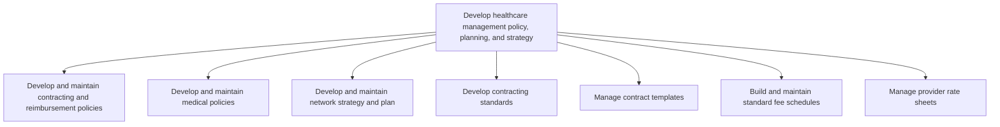

# Develop healthcare management policy, planning, and strategy

> TODO: Business-as-Code definition for develop healthcare management policy, planning, and strategy (unknown)

## Overview

TODO: Add process overview

## Process Hierarchy



## GraphDL

```yaml
develop:
  object: Healthcare Management Policy, Planning, And Strategy
  actor: TODO
  result: TODO
```

## Actions

| Action | Description |
|--------|-------------|
| TODO | TODO |

## Events

| Event | Description |
|-------|-------------|
| TODO | TODO |

## Searches

| Search | Description |
|--------|-------------|
| TODO | TODO |

## Process Flow


## RACI Matrix

| Activity | Responsible | Accountable | Consulted | Informed |
|----------|-------------|-------------|-----------|----------|
| TODO | TODO | TODO | TODO | TODO |

## Sub-Processes

| ID | Name | Description |
|----|------|-------------|
| 5.2.1.1 | Develop and maintain contracting and reimbursement policies | TODO |
| 5.2.1.2 | Develop and maintain medical policies | TODO |
| 5.2.1.3 | Develop and maintain network strategy and plan | TODO |
| 5.2.1.4 | Develop contracting standards | TODO |
| 5.2.1.5 | Manage contract templates | TODO |
| 5.2.1.6 | Build and maintain standard fee schedules | TODO |
| 5.2.1.7 | Manage provider rate sheets | TODO |

## Related Processes

| Process | Relationship |
|---------|-------------|
| TODO | TODO |

## Related Departments

| Department | Role |
|-----------|------|
| TODO | TODO |

## Related Occupations

| Occupation | Involvement |
|-----------|-------------|
| TODO | TODO |

## KPIs

| KPI | Description | Unit |
|-----|-------------|------|
| TODO | TODO | TODO |

## Usage

```typescript
import { TODO } from '@headlessly/develop-healthcare-management-policy,-planning,-and-strategy'

const client = TODO()

// TODO: Example action calls
```
