# Develop and manage the network

> TODO: Business-as-Code definition for develop and manage the network (unknown)

## Overview

TODO: Add process overview

## Process Hierarchy

```mermaid
graph TD
    A[Develop and manage the network]
    A --> B[Identify and recruit providers]
    A --> C[Credential and re-credential providers]
    A --> D[Negotiate and contract with providers]
    A --> E[Profile providers]
    A --> F[Manage provider practice/group arrangements]
    A --> G[Assemble provider market intelligence]
    A --> H[Assemble provider performance indicators]
    A --> I[Manage and monitor providers]
    A --> J[Manage revenue cycle]
    A --> K[Develop provider communications]
    A --> L[Educate and train providers]
    A --> M[Maintain provider data and directories]
    A --> N[Manage quality and performance of the network management process]
    A --> O[Manage ancillary services]
    A --> P[Manage lab services]
    A --> Q[Manage other ancillary services]
```



## GraphDL

```yaml
develop:
  object: And Manage Network
  actor: TODO
  result: TODO
```

## Actions

| Action | Description |
|--------|-------------|
| TODO | TODO |

## Events

| Event | Description |
|-------|-------------|
| TODO | TODO |

## Searches

| Search | Description |
|--------|-------------|
| TODO | TODO |

## Process Flow


## RACI Matrix

| Activity | Responsible | Accountable | Consulted | Informed |
|----------|-------------|-------------|-----------|----------|
| TODO | TODO | TODO | TODO | TODO |

## Sub-Processes

| ID | Name | Description |
|----|------|-------------|
| 5.2.2.1 | Identify and recruit providers | TODO |
| 5.2.2.2 | Credential and re-credential providers | TODO |
| 5.2.2.3 | Negotiate and contract with providers | TODO |
| 5.2.2.4 | Profile providers | TODO |
| 5.2.2.5 | Manage provider practice/group arrangements | TODO |
| 5.2.2.6 | Assemble provider market intelligence | TODO |
| 5.2.2.7 | Assemble provider performance indicators | TODO |
| 5.2.2.8 | Manage and monitor providers | TODO |
| 5.2.2.9 | Manage revenue cycle | TODO |
| 5.2.2.10 | Develop provider communications | TODO |
| 5.2.2.11 | Educate and train providers | TODO |
| 5.2.2.12 | Maintain provider data and directories | TODO |
| 5.2.2.13 | Manage quality and performance of the network management process | TODO |
| 5.2.2.14 | Manage ancillary services | TODO |
| 5.2.2.15 | Manage lab services | TODO |
| 5.2.2.16 | Manage other ancillary services | TODO |

## Related Processes

| Process | Relationship |
|---------|-------------|
| TODO | TODO |

## Related Departments

| Department | Role |
|-----------|------|
| TODO | TODO |

## Related Occupations

| Occupation | Involvement |
|-----------|-------------|
| TODO | TODO |

## KPIs

| KPI | Description | Unit |
|-----|-------------|------|
| TODO | TODO | TODO |

## Usage

```typescript
import { TODO } from '@headlessly/develop-and-manage-network'

const client = TODO()

// TODO: Example action calls
```
