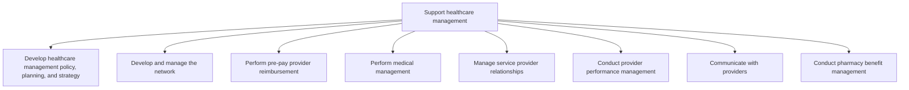

# Support healthcare management

> TODO: Business-as-Code definition for support healthcare management (unknown)

## Overview

TODO: Add process overview

## Process Hierarchy



## GraphDL

```yaml
support:
  object: Healthcare Management
  actor: TODO
  result: TODO
```

## Actions

| Action | Description |
|--------|-------------|
| TODO | TODO |

## Events

| Event | Description |
|-------|-------------|
| TODO | TODO |

## Searches

| Search | Description |
|--------|-------------|
| TODO | TODO |

## Process Flow


## RACI Matrix

| Activity | Responsible | Accountable | Consulted | Informed |
|----------|-------------|-------------|-----------|----------|
| TODO | TODO | TODO | TODO | TODO |

## Sub-Processes

| ID | Name | Description |
|----|------|-------------|
| 5.2.1 | Develop healthcare management policy, planning, and strategy | TODO |
| 5.2.2 | Develop and manage the network | TODO |
| 5.2.3 | Perform pre-pay provider reimbursement | TODO |
| 5.2.4 | Perform medical management | TODO |
| 5.2.5 | Manage service provider relationships | TODO |
| 5.2.6 | Conduct provider performance management | TODO |
| 5.2.7 | Communicate with providers | TODO |
| 5.2.8 | Conduct pharmacy benefit management | TODO |

## Related Processes

| Process | Relationship |
|---------|-------------|
| TODO | TODO |

## Related Departments

| Department | Role |
|-----------|------|
| TODO | TODO |

## Related Occupations

| Occupation | Involvement |
|-----------|-------------|
| TODO | TODO |

## KPIs

| KPI | Description | Unit |
|-----|-------------|------|
| TODO | TODO | TODO |

## Usage

```typescript
import { TODO } from '@headlessly/support-healthcare-management'

const client = TODO()

// TODO: Example action calls
```
