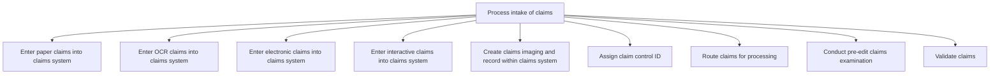

# Process intake of claims

> TODO: Business-as-Code definition for process intake of claims (unknown)

## Overview

TODO: Add process overview

## Process Hierarchy



## GraphDL

```yaml
process:
  object: Intake Of Claims
  actor: TODO
  result: TODO
```

## Actions

| Action | Description |
|--------|-------------|
| TODO | TODO |

## Events

| Event | Description |
|-------|-------------|
| TODO | TODO |

## Searches

| Search | Description |
|--------|-------------|
| TODO | TODO |

## Process Flow


## RACI Matrix

| Activity | Responsible | Accountable | Consulted | Informed |
|----------|-------------|-------------|-----------|----------|
| TODO | TODO | TODO | TODO | TODO |

## Sub-Processes

| ID | Name | Description |
|----|------|-------------|
| 5.3.3.1 | Enter paper claims into claims system | TODO |
| 5.3.3.2 | Enter OCR claims into claims system | TODO |
| 5.3.3.3 | Enter electronic claims into claims system | TODO |
| 5.3.3.4 | Enter interactive claims into claims system | TODO |
| 5.3.3.5 | Create claims imaging and record within claims system | TODO |
| 5.3.3.6 | Assign claim control ID | TODO |
| 5.3.3.7 | Route claims for processing | TODO |
| 5.3.3.8 | Conduct pre-edit claims examination | TODO |
| 5.3.3.9 | Validate claims | TODO |

## Related Processes

| Process | Relationship |
|---------|-------------|
| TODO | TODO |

## Related Departments

| Department | Role |
|-----------|------|
| TODO | TODO |

## Related Occupations

| Occupation | Involvement |
|-----------|-------------|
| TODO | TODO |

## KPIs

| KPI | Description | Unit |
|-----|-------------|------|
| TODO | TODO | TODO |

## Usage

```typescript
import { TODO } from '@headlessly/process-intake-of-claims'

const client = TODO()

// TODO: Example action calls
```
